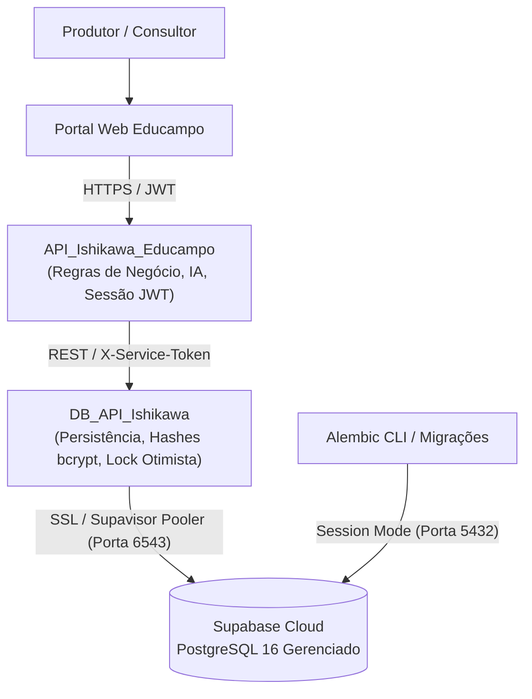

# DB_API_Ishikawa

> [!NOTE]
> **Visão de Negócio & Propósito:**
> Microsserviço dedicado de **persistência relacional e validação de credenciais** do Ecossistema Educampo Ishikawa. Ele isola a camada de dados da aplicação principal (`API_Ishikawa_Educampo`), garantindo persistência durável em nuvem via **Supabase (PostgreSQL 16 gerenciado)**, integridade referencial estrita, controle otimista de concorrência e autoridade exclusiva sobre hashes de senhas.
>
> *Ref: Decisões arquiteturais registradas em [[2026-10-07-supabase-managed-postgres-and-credential-ownership]] e [[sdd-db-api-ishikawa]].*

---

## Tech Stack

* **Core:** Python 3.12+ · FastAPI · Pydantic v2 · uv
* **Banco de Dados & ORM:** PostgreSQL 16 · SQLAlchemy 2.0 (async/sync pools) · Alembic · psycopg3
* **Segurança:** bcrypt (armazenamento exclusivo de hashes) · Autenticação interna via cabeçalho `X-Service-Token` · Row Level Security (RLS)
* **Qualidade & Testes:** pytest · pytest-cov · httpx · Testcontainers (PostgreSQL real para testes de integração)

---

## Arquitetura & Como Funciona a API

A `DB_API_Ishikawa` não atende diretamente usuários finais nem frontends públicos. Ela atua como a **única camada de acesso ao banco relacional**, servindo exclusivamente à `API_Ishikawa_Educampo` por meio de uma rede interna protegida por token de serviço.



### Princípios de Funcionamento

1. **Separação de Responsabilidades (BFF vs. Persistência):**
   * A `API_Ishikawa_Educampo` processa a inteligência de negócios, diagnósticos e emite tokens JWT para o navegador.
   * A `DB_API_Ishikawa` é a única autoridade que grava, consulta e atualiza as entidades relacionais (Consultores, Produtores e Resultados de Diagnósticos).

2. **Guardiã de Credenciais e Segurança de Login:**
   * Senhas são tratadas unicamente como hashes criptográficos salgados com **bcrypt**. O campo `hashed_password` **nunca** é retornado em respostas da API.
   * Na autenticação, a `API_Ishikawa_Educampo` delega a validação para o endpoint interno `POST /v1/auth/verify`. A `DB_API_Ishikawa` valida a credencial em tempo constante contra ataques de temporização e retorna apenas a confirmação e perfil do usuário.

3. **Controle Otimista de Concorrência (Lock Otimista):**
   * Em recursos concorrentes (como resultados de diagnósticos), cada registro possui uma coluna de versão numérica sequencial.
   * As atualizações exigem o envio do cabeçalho `If-Match: <versao>`. Caso outro consultor tenha salvo alterações simultaneamente, a API rejeita a requisição com **HTTP 412 Precondition Failed**, prevenindo perda silenciosa de dados.

4. **Padronização RFC 7807:**
   * Todas as falhas e erros de validação retornam no padrão internacional `application/problem+json`, assegurando previsibilidade e facilidade de depuração para clientes da API.

5. **Estratégia Híbrida de Ambientes:**
   * **Desenvolvimento Local & CI:** Contêiner Docker local (`postgres:16-alpine`) e `testcontainers[postgres]`, permitindo desenvolvimento rápido, offline e testes isolados sem custos de nuvem.
   * **Staging & Produção:** Conexão direta ao PostgreSQL 16 gerenciado no Supabase através do pooler Supavisor.

---

## Resumo dos Endpoints (`/v1`)

Todas as rotas sob o prefixo `/v1` requerem o cabeçalho `X-Service-Token`. Em ambiente de desenvolvimento, a interface interativa Swagger fica disponível em `/docs`.

| Domínio | Método e Rota | Descrição |
|---|---|---|
| **Saúde** | `GET /health/live` | Verificação de liveness do processo da API |
| **Saúde** | `GET /health/ready` | Verificação de readiness e conectividade ativa com o PostgreSQL |
| **Autenticação** | `POST /v1/auth/verify` | Validação de credenciais (email/senha/papel) contra hash bcrypt |
| **Consultores** | `POST /v1/consultants` | Criação de consultor com hashing seguro de senha |
| **Consultores** | `GET /v1/consultants` | Listagem paginada (`limit`, `offset`) com header `X-Total-Count` |
| **Consultores** | `GET /v1/consultants/{id}` | Busca de consultor por ID com contagem derivada de produtores |
| **Consultores** | `PUT /v1/consultants/{id}` | Atualização de dados cadastrais |
| **Produtores** | `POST /v1/producers` | Cadastro de produtor vinculado obrigatoriamente a um consultor |
| **Produtores** | `GET /v1/producers` | Listagem com filtros por `email` e `nome`, suporte a paginação |
| **Produtores** | `GET /v1/producers/{id}` | Detalhes do produtor |
| **Produtores** | `PUT /v1/producers/{id}` | Atualização de produtor (senha é imutável via PUT cadastral) |
| **Produtores** | `DELETE /v1/producers/{id}` | Exclusão de produtor e dados associados |
| **Diagnósticos** | `GET /v1/diagnostic-results/{producer_id}` | Recupera o resultado de diagnóstico mais recente e versão |
| **Diagnósticos** | `PUT /v1/diagnostic-results/{producer_id}` | Upsert com lock otimista (`If-Match: <versao>`) |

---

## Configuração de Ambiente

Crie o arquivo `.env` baseado no `.env.example`:

| Variável | Descrição | Exemplo / Padrão |
|---|---|---|
| `ENVIRONMENT` | Ambiente de execução (`development` ou `production`) | `development` |
| `API_V1_STR` | Prefixo global dos endpoints de negócio | `/v1` |
| `DATABASE_URL` | String de conexão SQLAlchemy psycopg3 | `postgresql+psycopg://...` |
| `SERVICE_TOKEN` | Token secreto compartilhado exigido no `X-Service-Token` | *Token forte e aleatório* |
| `SEED_ON_STARTUP` | Executa importação de dados mock no startup se ativado | `false` |
| `SEED_DATA_PATH` | Caminho do JSON de dados iniciais | `app/resources/test_data/farms.json` |
| `DB_POOL_SIZE` | Quantidade de conexões permanentes no pool SQLAlchemy | `5` |
| `DB_MAX_OVERFLOW` | Conexões transitórias adicionais suportadas | `10` |
| `DB_PREPARE_THRESHOLD` | `None` para Supavisor em *transaction mode*, ou inteiro em dev | `None` |

---

## Como Executar Localmente

### Opção 1: Com Docker Compose (API + PostgreSQL Local)

Inicia o PostgreSQL na porta `5433` (com volume persistente local) e a API na porta `8002`:

```bash
docker compose up --build
```

### Opção 2: Com Gerenciador `uv` (Execução Nativa)

Requer um banco PostgreSQL ativo configurado no `.env`:

```bash
# 1. Instalar dependências
uv sync

# 2. Executar migrações do banco
alembic upgrade head

# 3. Iniciar a API em modo reload
uv run uvicorn app.main:app --reload --port 8001
```

---

## Testes e Validação

A suíte de testes inclui testes unitários isolados e testes de integração de ponta a ponta que sobem instâncias reais de PostgreSQL em contêineres temporários via Testcontainers:

```bash
# Executar todos os testes
uv run pytest

# Executar com relatório de cobertura
uv run pytest --cov=app --cov-report=term-missing
```

### Seed de Dados Idempotente

Para popular o banco com dados de teste (`farms.json`):

```bash
uv run python -m app.seed.import_farms
```

> A rotina utiliza cláusulas de idempotência (`ON CONFLICT DO NOTHING`), garantindo que execuções sucessivas não gerem duplicidade nem sobrescrevam registros existentes.

### Baseline de Latência (p95 < 50ms)

Para validar a performance de resposta e tempo de execução das consultas:

```bash
uv run python scripts/benchmark_latency.py --iterations 50
```

---

## Deploy: Render + Supabase

1. **Host do Banco:** Utilize a connection string do **pooler Supavisor** do Supabase (`aws-0-[regiao].pooler.supabase.com:6543`), que oferece compatibilidade IPv4 (necessária para planos padrão do Render) e gerenciamento otimizado de pooling.
2. **Migrações:** Execute as migrações do Alembic apontando para a porta `5432` (Session Mode do pooler):
   ```bash
   alembic upgrade head
   ```
3. **Segurança de Dados (RLS):** As migrações habilitam **Row Level Security (RLS)** em todas as tabelas públicas, bloqueando acessos não autorizados diretos através de chaves públicas ou anônimas do Supabase.

---

## Onde você precisa ter atenção no futuro?

Esta seção resume os cuidados arquiteturais e operacionais fundamentais para manter a estabilidade do sistema e a integridade dos dados ao longo do ciclo de vida da aplicação:

### 1. Preservação dos Dados no Supabase vs. Deploys da API
* **Segurança Total no Código:** O banco de dados em nuvem no Supabase está **completamente desacoplado** do contêiner da `DB_API_Ishikawa`. Alterar rotas, refatorar serviços, ajustar modelos Pydantic ou fazer novos deploys no Render **não apaga nem afeta** nenhum dado já gravado no Supabase.
* **Ciclo de Vida Independente:** Reiniciar a API ou subir uma nova versão não toca nos discos persistentes do Supabase nem nos backups automáticos gerenciados pela infraestrutura da nuvem.

### 2. Evolução de Schema e Migrações no Alembic
* **Migrações Incrementais (Aditivas):** Ao evoluir o sistema, criar novas tabelas (`op.create_table`) ou adicionar novas colunas (`op.add_column(..., nullable=True)`) é uma operação 100% segura que preserva todos os registros anteriores.
* **Cuidado Crítico com Migrações Destrutivas:** O Alembic executará qualquer instrução enviada a ele. **Nunca** crie ou execute migrações contendo `op.drop_table()` ou `op.drop_column()` em produção sem antes realizar um backup manual e validar se há dependências ativas.
* **Porta de Execução do Alembic:** O Supavisor opera em dois modos:
  * **Porta 6543 (Transaction Mode):** Usada pela API em tempo de execução para alta concorrência de queries. Não suporta transações de alteração de schema DDL com prepared statements.
  * **Porta 5432 (Session Mode):** Deve ser utilizada **obrigatoriamente** para rodar `alembic upgrade head`.

### 3. Idempotência em Seeds e Scripts de Carga
* O script `import_farms.py` foi projetado para ser estritamente idempotente. Caso você desenvolva novos scripts de carga, migração de dados ou rotinas de manutenção, utilize sempre verificações de existência prévia (`SELECT` antes de inserir ou cláusulas `ON CONFLICT DO NOTHING / UPDATE`) para evitar duplicidade de cadastros de consultores ou sobreescrita acidental de diagnósticos de produtores.

### 4. Gestão de Conexões e Pooler Supavisor
* Como o Supabase opera em um ambiente multi-tenant com limites de conexões simultâneas, mantenha sempre:
  * `DB_POOL_SIZE` baixo (padrão `5`) e `DB_MAX_OVERFLOW` contido (padrão `10`).
  * `DB_PREPARE_THRESHOLD=None` nas configurações do psycopg quando conectado via Supavisor em Transaction Mode, evitando erros de prepared statements entre diferentes conexões reaproveitadas pelo pooler.

### 5. Políticas de Row Level Security (RLS)
* Todas as tabelas públicas (`consultants`, `producers`, `diagnostic_results`, `alembic_version`) possuem RLS ativado sem permissões anônimas.
* Caso adicione novas tabelas no futuro via Alembic, lembre-se de sempre incluir na migração a instrução para ativar o RLS:
  ```python
  op.execute("ALTER TABLE nome_da_tabela ENABLE ROW LEVEL SECURITY;")
  ```
  Isso garante que a tabela não fique exposta caso as chaves públicas da API do Supabase venham a ser utilizadas em outros serviços.

### 6. Contrato de Confidencialidade de Credenciais
* A `DB_API_Ishikawa` deve continuar sendo a **única detentora** dos hashes de senha. Nunca altere schemas de saída Pydantic para incluir o campo de hash e nunca trafegue credenciais em logs de aplicação ou parâmetros de URL (`query params`).
