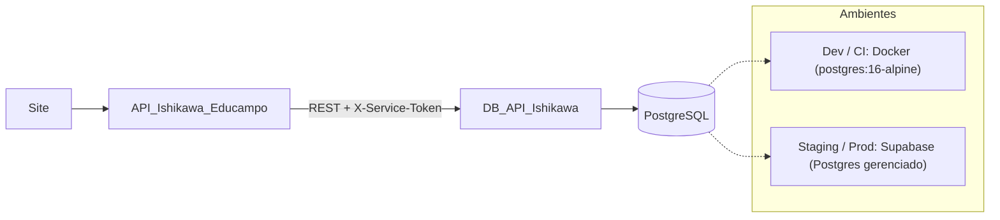

# DB_API_Ishikawa

Serviço dedicado de **persistência e validação de credenciais** do ecossistema Educampo Ishikawa. Expõe uma API REST interna (`/v1`) cujo contrato espelha 1:1 as interfaces `IProducerRepository`, `IConsultantRepository` e `IDiagnosticResultRepository` da `API_Ishikawa_Educampo`.

**Stack:** FastAPI · SQLAlchemy 2.0 · Alembic · Pydantic v2 · PostgreSQL 16 · bcrypt · uv

## Status

| Fase | Conteúdo | Estado |
|---|---|---|
| F1 | Skeleton, consultores, `POST /v1/auth/verify` | ✅ Concluída |
| F2 | Produtores, `producers_managed` derivado, auth de produtor | ✅ Concluída |
| F3 | Resultados de diagnóstico (`/v1/diagnostic-results`) com lock otimista | ✅ Concluída |
| F4 | Seed idempotente, hardening Supabase (RLS, Supavisor) e baseline p95 | ✅ Concluída |

Especificação completa: [feature_spec_db_api_ishikawa.md](./feature_spec_db_api_ishikawa.md) · Épico: [epic_db_api_ishikawa_service.md](./epic_db_api_ishikawa_service.md) · Roadmap: [feature_roadmap_persistencia_incremental.md](./feature_roadmap_persistencia_incremental.md) · [Guia de Consumo para a API Ishikawa](./docs/client_integration_guide.md)

## Arquitetura



| Componente | Responsabilidade |
|---|---|
| `API_Ishikawa_Educampo` | Regras de negócio e IA, sessão (JWT) e autorização de papéis |
| **`DB_API_Ishikawa`** | Persistência, integridade, **hash bcrypt e verificação de credenciais**, lock otimista |
| PostgreSQL | Armazenamento. Docker local em dev/CI; **Supabase apenas como Postgres gerenciado** em staging/prod (sem SDK, Auth, Storage ou Realtime) |

Trocar de provedor de banco = trocar `DATABASE_URL`.

### Credenciais e login

- Senhas são salvas apenas como hash bcrypt; `hashed_password` **nunca** aparece em respostas.
- Login: a API Ishikawa chama `POST /v1/auth/verify` com `{email, password, role}` e recebe `{id, role}` (200) ou 401 idêntico para e-mail inexistente e senha errada.
- Cadastro: `POST /v1/consultants` cria consultores; um consultor cadastra produtores via `POST /v1/producers` (valida `consultant_id`). A senha é imutável no `PUT /v1/producers/{id}`.

## Endpoints

Todas as rotas `/v1` exigem o header `X-Service-Token`. Erros seguem RFC 7807 (`application/problem+json`). Listagens aceitam `limit` (máx. 200) e `offset` e devolvem `X-Total-Count`. Atualizações usam `If-Match: <version>` (412 em conflito).

| Recurso | Rotas |
|---|---|
| Consultores | `POST/GET /v1/consultants`, `GET/PUT /v1/consultants/{id}` |
| Produtores | `POST/GET /v1/producers`, `GET/PUT/DELETE /v1/producers/{id}` (filtros `email`, `nome`) |
| Diagnósticos | `GET/PUT /v1/diagnostic-results/{producer_id}` (upsert com lock otimista) |
| Auth | `POST /v1/auth/verify` |
| Saúde | `GET /health/live`, `GET /health/ready` |

Em desenvolvimento a documentação interativa fica em `/docs`.

## Configuração

Copie `.env.example` para `.env`:

| Variável | Descrição |
|---|---|
| `ENVIRONMENT` | `development` / `production` (em produção `/docs` fica desabilitado) |
| `API_V1_STR` | Prefixo das rotas (padrão `/v1`) |
| `DATABASE_URL` | URL SQLAlchemy (`postgresql+psycopg://...`) |
| `SERVICE_TOKEN` | Segredo compartilhado com a API Ishikawa. **Troque em produção** |
| `SEED_ON_STARTUP` | `true`/`false` (importa dados mock no startup se ativado) |
| `SEED_DATA_PATH` | Caminho do JSON de seed (padrão `app/resources/test_data/farms.json`) |
| `DB_POOL_SIZE` | Tamanho do pool SQLAlchemy (padrão `5`) |
| `DB_MAX_OVERFLOW` | Conexões extras de overflow (padrão `10`) |
| `DB_PREPARE_THRESHOLD` | `None` para Supavisor em *transaction mode*, ou inteiro |

## Seed de Dados Mock (farms.json)

O seed pode ser executado manualmente ou no startup da API:

```bash
# Execução manual via CLI
python -m app.seed.import_farms

# Ou defina SEED_ON_STARTUP=true no .env para popular na subida do container
```

A importação é **estritamente idempotente** (`ON CONFLICT DO NOTHING`), garantindo que execuções repetidas não dupliquem dados.

## Baseline de Latência (p95 < 50ms)

Aferição automatizada das métricas de tempo de resposta em rede interna (Critério S5):

```bash
python scripts/benchmark_latency.py --iterations 50
```

## Executando localmente

Com Docker (Postgres + API; API em `http://localhost:8002`, Postgres em `localhost:5433`):

```bash
docker compose up --build
```

Sem Docker para a API (precisa de um Postgres acessível em `DATABASE_URL`):

```bash
uv sync
alembic upgrade head
uvicorn app.main:app --reload --port 8001
```

## Testes

Os testes de integração usam Postgres real via testcontainers (requer Docker em execução).

```bash
uv run pytest
```

## Deploy: Render + Supabase

1. No Supabase, copie a connection string do **pooler (Supavisor)** (o host direto é IPv6 e o Render não tem saída IPv6).
2. No Render, defina `DATABASE_URL=postgresql+psycopg://postgres.<ref>:<senha>@aws-0-<regiao>.pooler.supabase.com:6543/postgres?sslmode=require` e um `SERVICE_TOKEN` forte.
3. Rode as migrações pelo modo *session* do pooler (porta `5432`): `alembic upgrade head`. A migração `004_enable_rls` ativa Row Level Security em todas as tabelas (D19).
4. O pooler opera com `prepare_threshold=None` e limites controlados de pool.

## Estrutura

```text
app/
├── main.py          # FastAPI, lifespan com seed condicional, handlers RFC 7807
├── core/            # config, security (bcrypt, X-Service-Token), errors
├── api/             # health.py e v1/ (auth, consultants, producers, diagnostic_results)
├── schemas/         # DTOs Pydantic
├── services/        # regras de negócio e concorrência
├── seed/            # import_farms.py (módulo e CLI de seed)
├── resources/       # test_data/farms.json
└── db/              # models, session (pooling/Supavisor), repositories
alembic/             # migrações (001 consultores, 002 produtores, 003 diagnósticos, 004 RLS)
scripts/             # benchmark_latency.py
docs/                # client_integration_guide.md
tests/               # unit/ e integration/ (testcontainers)
```
