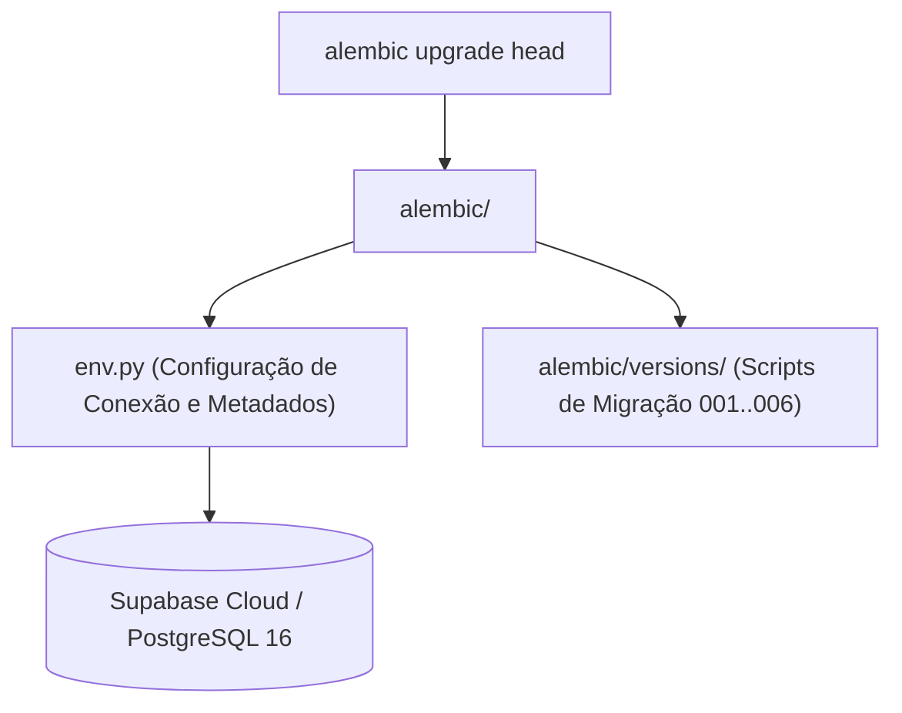

# Directory Documentation: `alembic`

## Overview
* **Purpose:** Gerenciamento do ciclo de vida, evolução e versionamento do schema do banco de dados PostgreSQL via Alembic. Centraliza configurações de migração, mapeamento de metadados ORM e templates de geração de scripts.
* **Layer:** Infrastructure / Database Migrations

## Architecture and Data Flow

## Component Mapping
* `env.py`: Script de execução de ambiente do Alembic, integrando as configurações de URL (`app.core.config.settings.DATABASE_URL`) aos metadados do SQLAlchemy (`Base.metadata`).
* `script.py.mako`: Template Mako utilizado pelo comando `alembic revision` para scaffolding de novas migrações.
* `versions/`: Diretório que armazena os scripts sequenciais de migração do schema.

## Design Decisions & Trade-offs
* **Decision:** Migrações executadas prioritariamente via porta 5432 (modo Session do Supabase).
* **Motivation:** Comandos DDL do PostgreSQL exigem recursos de transação que não são recomendados através do pooler Supavisor na porta 6543 (modo Transaction).
* **Decision:** Definição explícita de `target_metadata = Base.metadata` em `env.py`.
* **Motivation:** Permite detecção automática de alterações no modelo através de `alembic revision --autogenerate`.

## Testing Strategy
* **Test Types:** Unit / Integration
* **Critical Scenarios:** Testes de validação de migrações estruturais e políticas de segurança RLS (`test_migration_006.py`, `test_rls_migration.py`).

## Related Context
* Obsidian Vault: `[[2026-10-07-supabase-managed-postgres-and-credential-ownership]]`, `[[sdd-db-api-skeleton-consultants]]`
