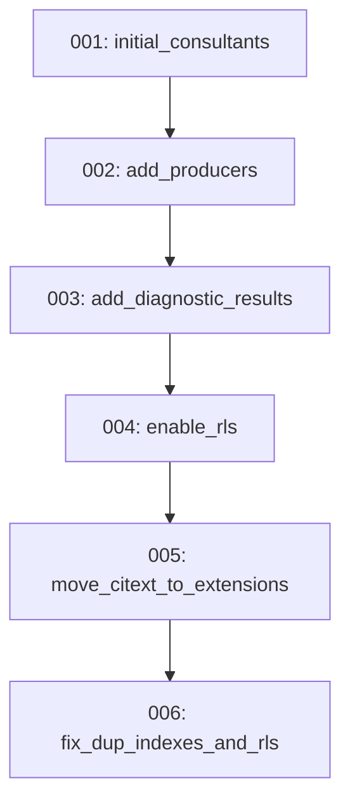

# Directory Documentation: `alembic/versions`

## Overview
* **Purpose:** Repositório dos scripts sequenciais de migração do schema do banco de dados relacional. Registra todo o histórico evolutivo de criação de tabelas, índices, extensões PostgreSQL e políticas de segurança RLS.
* **Layer:** Infrastructure / Database Migrations

## Architecture and Data Flow

## Component Mapping
* `001_initial_consultants.py`: Migração inicial criando extensão `citext`, tabela de consultores (`consultants`) com hash bcrypt e controle de versão.
* `002_add_producers.py`: Introdução da tabela de produtores (`producers`), FK vinculada a consultores, campos JSONB e índices funcionais `lower(nome)`.
* `003_add_diagnostic_results.py`: Criação da tabela `diagnostic_results` com chave primária 1:1 referenciando produtores e payloads JSONB.
* `004_enable_rls.py`: Habilitação de Row Level Security (RLS) para proteção contra acessos públicos diretos em nuvem Supabase.
* `005_move_citext_to_extensions.py`: Reorganização da extensão `citext` dentro do schema `extensions` conforme melhores práticas do Supabase.
* `006_fix_dup_indexes_and_rls.py`: Correção e alinhamento de índices redundantes e políticas de segurança apontados no database lint do Supabase.

## Design Decisions & Trade-offs
* **Decision:** Migrações individuais atômicas e rastreadas.
* **Motivation:** Permite reprodutibilidade perfeita do schema em instâncias limpas do PostgreSQL local ou no Supabase Cloud.

## Testing Strategy
* **Test Types:** Unit / Integration
* **Critical Scenarios:** Testes unitários focados nas migrações 004 e 006 (`test_rls_migration.py`, `test_migration_006.py`).

## Related Context
* Obsidian Vault: `[[2026-10-07-supabase-managed-postgres-and-credential-ownership]]`, `[[sdd-db-api-skeleton-consultants]]`
