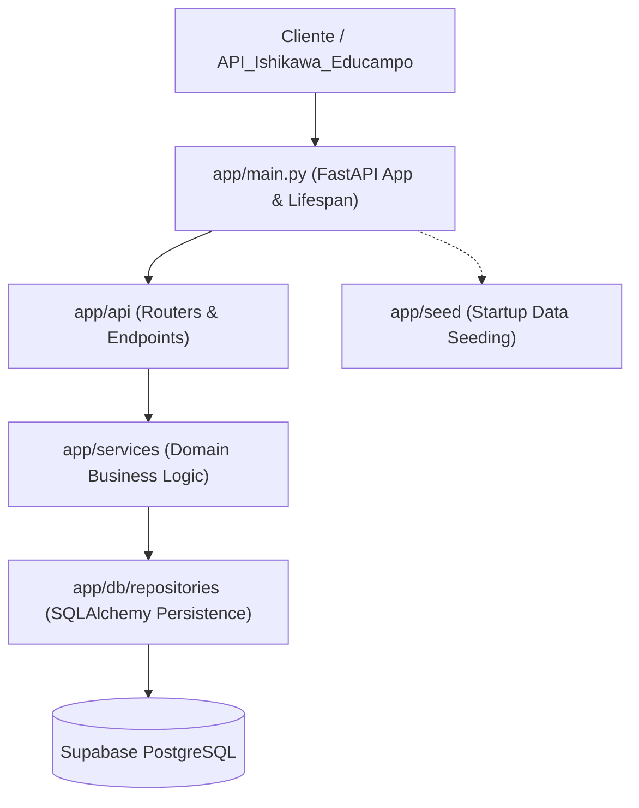

# Directory Documentation: `app`

## Overview
* **Purpose:** Pacote raiz da aplicação `DB_API_Ishikawa`. Centraliza a inicialização do FastAPI, gerenciamento de ciclo de vida (lifespan), middleware de CORS, tratamento padronizado de exceções (RFC 7807) e orquestração de todos os sub-módulos da arquitetura em camadas.
* **Layer:** Application / System Core

## Architecture and Data Flow

## Component Mapping
* `main.py`: Instanciação da aplicação FastAPI, lifespan assíncrono para seed condicional, registro de rotas `/v1` e `/health`, e mapeamento de `DomainError` para `application/problem+json`.
* `api/`: Camada de controle e roteamento HTTP (rotas públicas de health e rotas privadas `/v1`).
* `core/`: Configurações centrais (`Settings`), utilitários de segurança (hashing bcrypt e validação de `X-Service-Token`) e catálogo de exceções de domínio.
* `db/`: Camada de acesso a dados (modelos ORM SQLAlchemy, gerenciamento de sessões com pooling Supavisor e repositórios especializados).
* `schemas/`: Contratos de transferência de dados (DTOs Pydantic v2 com validação estrita).
* `seed/`: Mecanismo de importação idempotente de dados iniciais a partir de arquivos JSON.
* `services/`: Camada de aplicação contendo as regras de negócio, validação de unicidade e controle de versões.
* `resources/`: Dados estáticos e arquivos JSON utilizados para carga de testes e seed.

## Design Decisions & Trade-offs
* **Decision:** Aplicação de arquitetura em camadas bem delimitadas com injeção de dependências via `Depends`.
* **Motivation:** Permite testabilidade unitária ágil sem depender de conexão real com o banco de dados em tempo de desenvolvimento.
* **Decision:** Tratamento uniforme de erros via RFC 7807 (`ProblemDetail`).
* **Motivation:** Previne vazamento de detalhes internos da infraestrutura ou do banco de dados e oferece respostas consistentes para a `API_Ishikawa_Educampo`.

## Testing Strategy
* **Test Types:** Unit / Integration
* **Critical Scenarios:** Inicialização de lifespan (`test_lifespan_seed.py`), captura e conversão de erros de domínio para `ProblemDetail` (`test_security_errors.py`) e orquestração de rotas da aplicação (`test_api_routes.py`).

## Related Context
* Obsidian Vault: `[[sdd-db-api-skeleton-consultants]]`, `[[bdd-db-api-skeleton-consultants]]`
