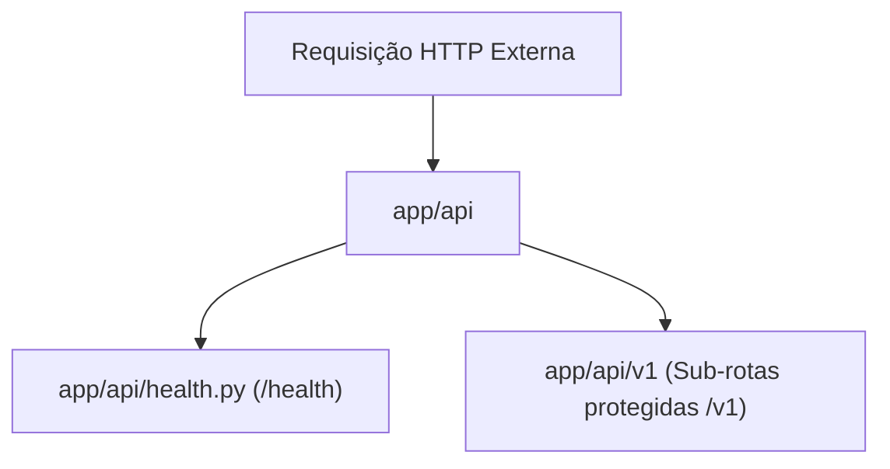

# Directory Documentation: `app/api`

## Overview
* **Purpose:** Camada de apresentação e interface HTTP. Agrupa os roteadores principais da aplicação, separando rotas públicas de integridade e monitoramento (`/health`) das rotas de negócio versionadas sob o sub-pacote `v1/`.
* **Layer:** Presentation / Controller

## Architecture and Data Flow

## Component Mapping
* `health.py`: Implementa o endpoint `/health` (GET) para checagens de liveness e readiness da aplicação sem exigência de cabeçalho de autenticação.
* `v1/`: Sub-diretório com os controladores versionados da API (`auth`, `consultants`, `producers`, `diagnostic_results`).

## Design Decisions & Trade-offs
* **Decision:** Exposição do endpoint `/health` na raiz sem exigência do token de serviço `X-Service-Token`.
* **Motivation:** Viabiliza o uso de sondas de liveness de contêineres e balanceadores de carga sem a necessidade de distribuir segredos para componentes de monitoramento.
* **Decision:** Versionamento explícito no nível de pacote (`v1/`).
* **Motivation:** Permite evolução independente de contratos e suporte a futuras versões (`v2/`) sem quebras retroativas.

## Testing Strategy
* **Test Types:** Unit / Integration
* **Critical Scenarios:** Validação de payload e status 200 OK da rota `/health` (`tests/unit/test_api_routes.py`).

## Related Context
* Obsidian Vault: `[[health-admin-routes]]`, `[[sdd-db-api-skeleton-consultants]]`
