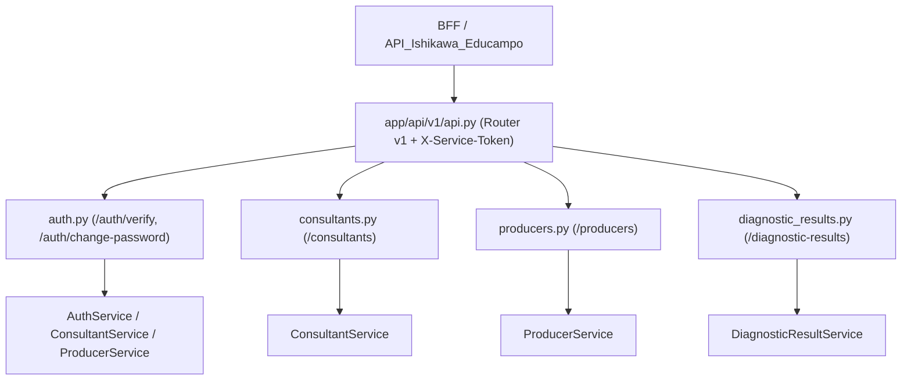

# Directory Documentation: `app/api/v1`

## Overview
* **Purpose:** Agrupamento dos controladores e rotas REST da versão 1 (`/v1`) da API. Centraliza a exposição dos endpoints protegidos de autenticação, consultores, produtores e resultados de diagnósticos, exigindo o cabeçalho `X-Service-Token`.
* **Layer:** Presentation / Controller (v1)

## Architecture and Data Flow

## Component Mapping
* `api.py`: Roteador agregador da v1 que consolida os roteadores de `auth`, `consultants`, `producers` e `diagnostic_results`.
* `auth.py`: Controladores de autenticação interna (`POST /auth/verify`) e atualização de senha (`POST /auth/change-password`), delegando para `AuthService`.
* `consultants.py`: Controladores de criação, consulta por ID, listagem paginada e atualização de consultores técnicos.
* `producers.py`: Controladores para gerenciamento de produtores rurais, busca determinística por nome e listagem vinculada a consultores.
* `diagnostic_results.py`: Controladores para leitura e gravação/atualização de diagnósticos agronômicos, validando o cabeçalho `If-Match` para lock otimista.

## Design Decisions & Trade-offs
* **Decision:** Dependência de autenticação `verify_service_token` injetada em nível de roteador.
* **Motivation:** Elimina o risco de esquecimento de proteção em novos endpoints criados na v1.
* **Decision:** Suporte a lock otimista obrigatório (`If-Match`) na persistência de diagnósticos.
* **Motivation:** Evita sobreescrita cega de pareceres técnicos quando múltiplos consultores ou sessões salvam alterações concorrentes.

## Testing Strategy
* **Test Types:** Unit / Integration
* **Critical Scenarios:** Validação de credenciais e roles (`test_auth_password.py`), respostas de erro RFC 7807 (`test_security_errors.py`), ciclo de vida de produtores (`test_producer_routes.py`), e validação de versão concorrente (`test_diagnostic_routes.py`).

## Related Context
* Obsidian Vault: `[[sdd-db-api-skeleton-consultants]]`, `[[bdd-db-api-password-management]]`, `[[audit-persistencia-resultados]]`
