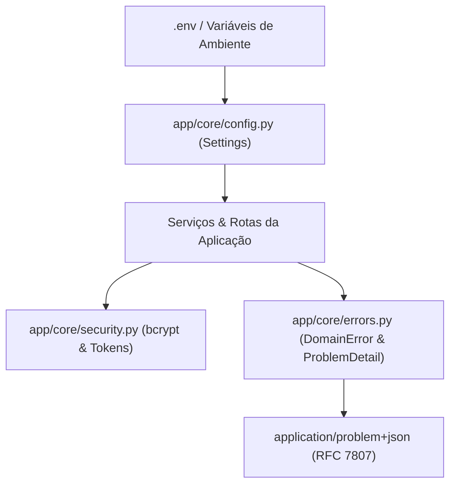

# Directory Documentation: `app/core`

## Overview
* **Purpose:** Núcleo transversal da aplicação. Contém as configurações do sistema baseadas em variáveis de ambiente, lógica criptográfica e de segurança para gestão de senhas/tokens, e hierarquia de exceções de domínio no padrão RFC 7807.
* **Layer:** Cross-cutting / Core

## Architecture and Data Flow

## Component Mapping
* `config.py`: Modelo `Settings` via `pydantic-settings`, gerenciando URLs de banco de dados (PostgreSQL local / Supabase pooler), limites de conexão do pool, flags de seed na inicialização e tokens internos.
* `security.py`: Implementa o hashing de senhas via `bcrypt` com salt gerado individualmente, verificação em tempo constante (`verify_password`) e a dependência de autorização interna `verify_service_token`.
* `errors.py`: Hierarquia de erros de domínio especializados derivados de `DomainError` e conversor para payloads estruturados no padrão RFC 7807 (`ProblemDetail`).

## Design Decisions & Trade-offs
* **Decision:** Hashing exclusivo e isolado com `bcrypt` salgado na camada da API de persistência.
* **Motivation:** Impede que o BFF ou serviços externos acessem diretamente o hash ou lidem com credenciais não salgadas, reduzindo drasticamente a superfície de ataque.
* **Decision:** Padronização RFC 7807 (`ProblemDetail`) para todas as respostas com status >= 400.
* **Motivation:** Previsibilidade de consumo e integração simplificada com diagnósticos detalhados para os clientes da API.

## Testing Strategy
* **Test Types:** Unit
* **Critical Scenarios:** Configurações de ambiente (`test_config_and_session.py`), hashes válidos/inválidos e mapeamento de respostas de erro (`test_security_errors.py`).

## Related Context
* Obsidian Vault: `[[sdd-db-api-skeleton-consultants]]`, `[[sdd-db-api-password-management]]`
