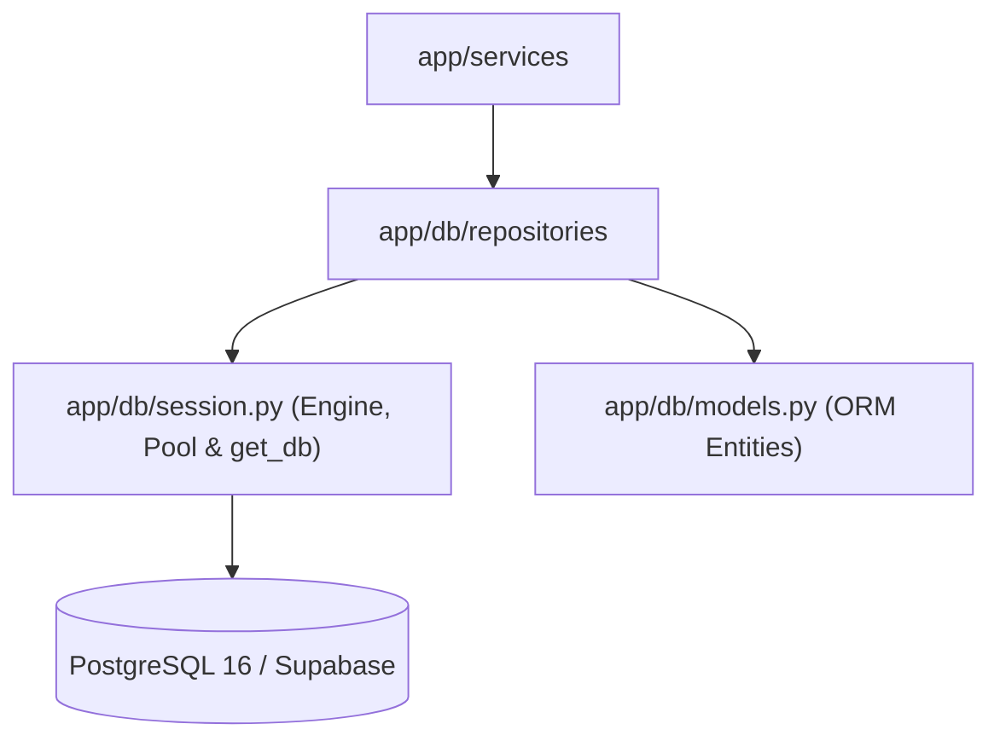

# Directory Documentation: `app/db`

## Overview
* **Purpose:** Camada de persistência relacional do microsserviço. Encapsula os modelos declarativos do SQLAlchemy 2.0, a configuração de conexão e pooling resiliente (otimizado para o Supavisor do Supabase) e a fábrica de sessões do banco de dados.
* **Layer:** Infrastructure / Persistence

## Architecture and Data Flow

## Component Mapping
* `models.py`: Entidades ORM declarativas do SQLAlchemy (`Consultant`, `Producer`, `DiagnosticResult`) com tipagem estrita, tipos avançados do PostgreSQL (`CITEXT`, `JSONB`, `UUID`), chaves estrangeiras com `SET NULL` ou `CASCADE` e colunas de versionamento sequencial.
* `session.py`: Inicialização da engine `psycopg3` com suporte a timeouts e limites de pool, fábrica de sessões (`sessionmaker`) e o gerador de injeção de dependência `get_db`.
* `repositories/`: Implementação concreta do padrão Repository, isolando consultas SQL e mutações de dados da lógica de negócio.

## Design Decisions & Trade-offs
* **Decision:** Uso do tipo `CITEXT` nativo para campos de e-mail e índices funcionais `lower(nome)`.
* **Motivation:** Elimina problemas de duplicidade causados por variações de maiúsculas/minúsculas e otimiza buscas textuais determinísticas.
* **Decision:** Configurações de pool parametrizadas com `prepare_threshold` customizável.
* **Motivation:** Assegura compatibilidade estrita tanto com conexões locais diretas quanto com o pooler em modo transação do Supabase (Supavisor).

## Testing Strategy
* **Test Types:** Unit / Integration
* **Critical Scenarios:** Validação de modelos ORM (`test_models.py`, `test_producer_models.py`, `test_diagnostic_models.py`), criação e fechamento correto de sessões (`test_config_and_session.py`), e testes de integração com banco de dados real via Testcontainers (`tests/integration/`).

## Related Context
* Obsidian Vault: `[[sdd-db-api-skeleton-consultants]]`, `[[2026-10-07-supabase-managed-postgres-and-credential-ownership]]`
