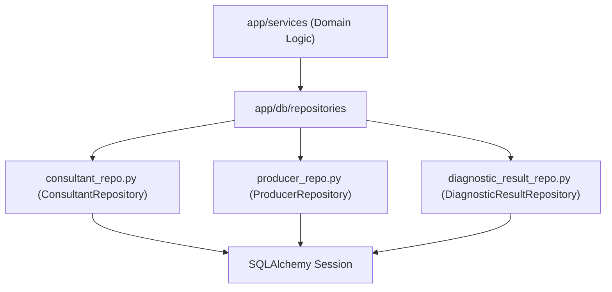

# Directory Documentation: `app/db/repositories`

## Overview
* **Purpose:** Camada de acesso a dados especializada utilizando o padrão Repository. Isola completamente as instruções SQL e queries do SQLAlchemy, fornecendo interfaces limpas para criação, busca paginada e atualizações atômicas com verificação de lock otimista.
* **Layer:** Infrastructure / Data Access

## Architecture and Data Flow

## Component Mapping
* `consultant_repo.py`: Implementa operações de persistência para a entidade `Consultant`, incluindo busca por e-mail normalizado, listagem paginada, contagem e recuperação de produtores subordinados.
* `producer_repo.py`: Gerencia operações de persistência para `Producer`, implementando paginação flexível com filtros, busca determinística por nome (ordenada por `created_at asc`) e controle de concorrência.
* `diagnostic_result_repo.py`: Realiza persistência e mutação de `DiagnosticResult`, executando updates atômicos condicionais à versão esperada (`version == expected_version`) com incremento atômico.

## Design Decisions & Trade-offs
* **Decision:** Atualizações atômicas condicionadas por versão (`update_atomic`) com cláusula `.returning()`.
* **Motivation:** Elimina a necessidade de bloqueios pessimistas no banco de dados (`SELECT FOR UPDATE`), mantendo alto throughput e prevenindo race conditions em gravações concorrentes.
* **Decision:** Injeção explícita da instância de `Session` no construtor de cada repositório.
* **Motivation:** Permite total desacoplamento e facilidade para mockar sessões em testes unitários rápidos.

## Testing Strategy
* **Test Types:** Unit / Integration
* **Critical Scenarios:** Mocks de repositório em testes unitários (`test_producer_repository.py`, `test_diagnostic_repository.py`) e validação real contra contêiner PostgreSQL (`test_consultants_postgres.py`, `test_producers_postgres.py`, `test_diagnostic_results_postgres.py`).

## Related Context
* Obsidian Vault: `[[sdd-db-api-skeleton-consultants]]`, `[[bdd-db-api-producers]]`, `[[audit-persistencia-resultados]]`
