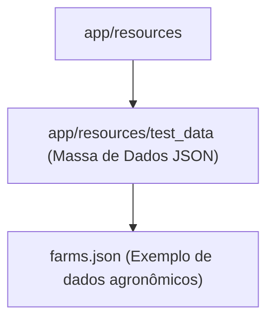

# Directory Documentation: `app/resources`

## Overview
* **Purpose:** Diretório para armazenamento de recursos estáticos, arquivos de configuração auxiliar e conjuntos de dados de referência (datasets) utilizados na aplicação.
* **Layer:** Infrastructure / Assets

## Architecture and Data Flow

## Component Mapping
* `test_data/`: Sub-diretório que armazena os dados de fazendas e produtores no formato JSON para testes e cargas iniciais do banco de dados.

## Design Decisions & Trade-offs
* **Decision:** Centralização de recursos estáticos empacotados junto à árvore `app/`.
* **Motivation:** Garante que os arquivos sejam copiados de maneira confiável durante a construção da imagem Docker sem depender do sistema de arquivos raiz do host.

## Testing Strategy
* **Test Types:** Integration
* **Critical Scenarios:** Verificação da integridade sintática e existência dos arquivos de recursos consumidos em tempo de inicialização.

## Related Context
* Obsidian Vault: `[[bdd-db-api-seed-hardening]]`
