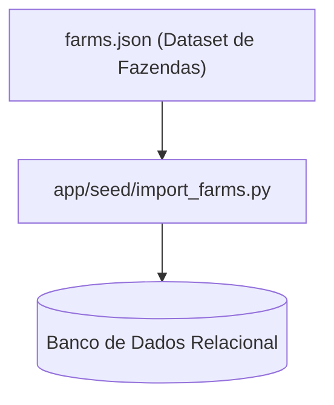

# Directory Documentation: `app/resources/test_data`

## Overview
* **Purpose:** Armazenamento de arquivos e conjuntos de dados estáticos para seeding e cenários de testes automatizados.
* **Layer:** Infrastructure / Fixtures

## Architecture and Data Flow

## Component Mapping
* `farms.json`: Arquivo contendo a estrutura de fazendas e produtores rurais de exemplo, utilizado na carga inicial idempotente do sistema.

## Design Decisions & Trade-offs
* **Decision:** Estruturação dos dados em JSON alinhada com as estruturas esperadas pelo parser `app/seed/import_farms.py`.
* **Motivation:** Permite execução repetível e idempotente do processo de seed tanto no startup local quanto em ambientes de teste.

## Testing Strategy
* **Test Types:** Unit / Integration
* **Critical Scenarios:** Testes unitários do leitor de JSON (`test_seed_importer.py`) e testes de carga em contêiner de integração (`test_seed_postgres.py`).

## Related Context
* Obsidian Vault: `[[bdd-db-api-seed-hardening]]`
