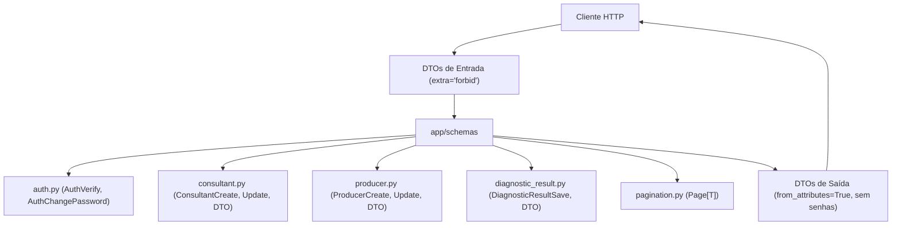

# Directory Documentation: `app/schemas`

## Overview
* **Purpose:** Camada de definição de contratos de dados (DTOs) utilizando Pydantic v2. Garante a validação sintática e semântica rigorosa das entradas da API e padroniza as respostas de saída, assegurando a blindagem de credenciais sensíveis.
* **Layer:** Domain / Contracts (DTO)

## Architecture and Data Flow

## Component Mapping
* `auth.py`: DTOs para verificação de credenciais e alteração de senha de consultores e produtores rurais.
* `consultant.py`: Modelos de dados para criação (`ConsultantCreateDTO`), atualização cadastral (`ConsultantUpdateDTO`) e visualização (`ConsultantDTO`).
* `producer.py`: Modelos para criação com metadados agronômicos (`ProducerCreateDTO`), atualização (`ProducerUpdateDTO`) e retorno (`ProducerDTO`).
* `diagnostic_result.py`: Contratos para salvamento (`DiagnosticResultSaveDTO`) e retorno com controle de versão otimista (`DiagnosticResultDTO`).
* `pagination.py`: Estrutura genérica de coleção paginada (`Page[T]`) reutilizável em todos os endpoints de listagem.

## Design Decisions & Trade-offs
* **Decision:** Configuração `extra="forbid"` em todos os payloads de entrada.
* **Motivation:** Impede o envio de parâmetros não documentados ou maliciosos, garantindo integridade estrita dos dados processados.
* **Decision:** Uso de `SecretStr` para campos de senha em trânsito e exclusão absoluta de `hashed_password` nos DTOs de resposta.
* **Motivation:** Elimina riscos de vazamento acidental de credenciais em logs ou respostas serializadas em JSON.

## Testing Strategy
* **Test Types:** Unit
* **Critical Scenarios:** Validação de regras de tamanho de senha, obrigatoriedade de campos, rejeição de campos desconhecidos e serialização correta de DTOs (`test_auth_password.py`, `test_producer_models.py`, `test_diagnostic_models.py`).

## Related Context
* Obsidian Vault: `[[sdd-db-api-skeleton-consultants]]`, `[[sdd-db-api-password-management]]`, `[[audit-persistencia-resultados]]`
