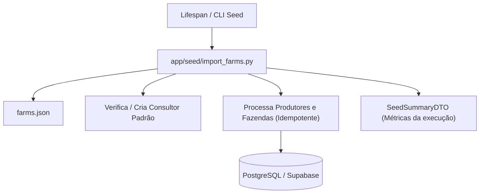

# Directory Documentation: `app/seed`

## Overview
* **Purpose:** Mecanismo de inicialização e carga de dados de desenvolvimento/teste (seeding). Responsável por popular o banco de dados de maneira idempotente com consultores de referência e produtores a partir de arquivos JSON externos.
* **Layer:** Infrastructure / Seeding Engine

## Architecture and Data Flow

## Component Mapping
* `import_farms.py`: Script e módulo de importação contendo constantes do consultor padrão, extração de identificadores, sanitização de dados e a rotina `import_farms_from_json`.

## Design Decisions & Trade-offs
* **Decision:** Idempotência estrita: consultas prévias por e-mail e ID antes de qualquer inserção.
* **Motivation:** Permite reexecuções seguras em inicializações sucessivas de contêineres sem gerar erros de violação de chave única (`DuplicateEmailError`).
* **Decision:** Retorno estruturado de estatísticas através de `SeedSummaryDTO`.
* **Motivation:** Oferece visibilidade detalhada do número de registros inseridos, ignorados e tempo total decorrido.

## Testing Strategy
* **Test Types:** Unit / Integration
* **Critical Scenarios:** Execução inicial de carga, idempotência em segunda execução consecutiva (`test_seed_importer.py`) e integração com banco real (`test_seed_postgres.py`).

## Related Context
* Obsidian Vault: `[[bdd-db-api-seed-hardening]]`
