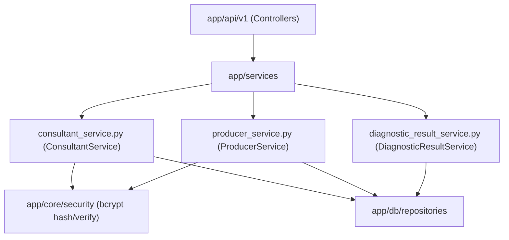

# Directory Documentation: `app/services`

## Overview
* **Purpose:** Camada de serviços de aplicação e domínio. Concentra a lógica de negócio, aplicação de invariantes de dados, regras de autenticação, hashing de credenciais com `bcrypt` e orquestração de concorrência otimista.
* **Layer:** Application / Domain Services

## Architecture and Data Flow

## Component Mapping
* `consultant_service.py`: Orquestra operações de negócio para consultores técnicos, hashing e conferência de senhas com `bcrypt`, verificação de unicidade de e-mail e gestão de produtores vinculados.
* `producer_service.py`: Implementa as regras de negócio de produtores rurais, validação de existência do consultor responsável, busca determinística por nome e gestão de credenciais.
* `diagnostic_result_service.py`: Coordena a persistência de diagnósticos agronômicos e simulações, implementando o upsert condicional (criação se inexistente, atualização com lock otimista se já existente).

## Design Decisions & Trade-offs
* **Decision:** Centralização de regras de negócio fora dos repositórios e dos controladores HTTP.
* **Motivation:** Promove alta coesão e baixo acoplamento, permitindo que a mesma lógica de negócio seja acionada por rotas HTTP ou por tarefas de background/CLI.
* **Decision:** Hashing salgado realizado estritamente dentro da camada de serviço antes de enviar a entidade ao repositório.
* **Motivation:** Garante que dados de texto puro nunca alcancem as camadas de persistência ou logs de SQL.

## Testing Strategy
* **Test Types:** Unit
* **Critical Scenarios:** Criação com e-mail duplicado (`DuplicateEmailError`), busca de entidade inexistente (`NotFoundError`), validação de senha incorreta (`InvalidCredentialsError`) e conflito de versão (`ConcurrencyConflictError`) cobertos em `test_consultant_service.py`, `test_producer_service.py` e `test_diagnostic_service.py`.

## Related Context
* Obsidian Vault: `[[sdd-db-api-skeleton-consultants]]`, `[[bdd-db-api-producers]]`, `[[audit-persistencia-resultados]]`
