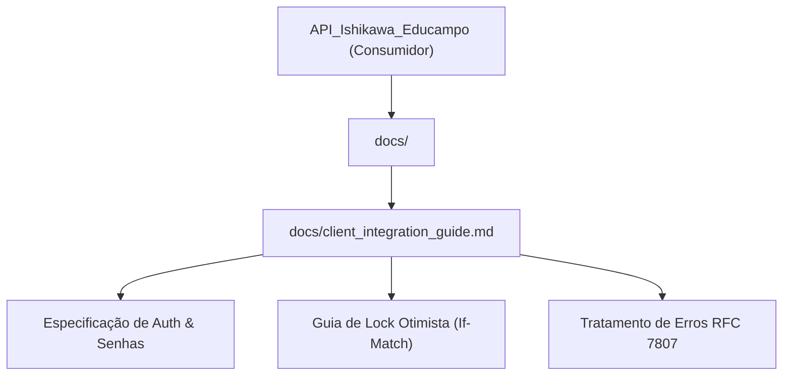

# Directory Documentation: `docs`

## Overview
* **Purpose:** Diretório de documentação técnica arquitetural e guias de integração para desenvolvedores e microsserviços consumidores (especialmente a `API_Ishikawa_Educampo`).
* **Layer:** Documentation / Integration Specs

## Architecture and Data Flow

## Component Mapping
* `client_integration_guide.md`: Manual prático e completo de integração para a `API_Ishikawa_Educampo`, cobrindo autenticação com `X-Service-Token`, endpoints de consultores, produtores, salvamento de diagnósticos com `If-Match` e catálogo de erros RFC 7807.

## Design Decisions & Trade-offs
* **Decision:** Manutenção de um guia de integração dedicado no repositório junto ao código-fonte.
* **Motivation:** Elimina discrepâncias entre a implementação da camada de persistência e os consumidores internos do ecossistema.

## Testing Strategy
* **Test Types:** Documentation Audit
* **Critical Scenarios:** Sincronia entre os contratos OpenAPI gerados pelo FastAPI e os exemplos descritos no guia.

## Related Context
* Obsidian Vault: `[[sdd-db-api-skeleton-consultants]]`, `[[health-admin-routes]]`
