# Arquitetura de Componentes e Camadas (DB_API_Ishikawa)

> [!NOTE]
> **Visão Geral Arquitetural:**
> O `DB_API_Ishikawa` é construído sob os princípios de **Clean Architecture**, **SOLID** e separação estrita de camadas. Este documento descreve os módulos internos do microsserviço, seus contratos, injeção de dependências, controle de transações e a interação com a infraestrutura em nuvem do Supabase.
>
> *Ref: [[sdd-db-api-ishikawa]], [[epic-db-api-ishikawa-service]] e [[2026-10-07-supabase-managed-postgres-and-credential-ownership]].*

---

## 1. Diagrama UML de Componentes e Camadas

O diagrama abaixo ilustra o fluxo de requisições, desde o cliente consumidor interno até o motor relacional do PostgreSQL 16.

### 1.1 Diagrama Renderizado (Imagem PNG)


---

### 1.2 Diagrama Mermaid Interativo

```mermaid
graph TD
    subgraph Consumidor["Consumidor Interno (M2M)"]
        MainAPI["API_Ishikawa_Educampo\n(Porta 8001 / Interna 8000)"]
        Adapters["Http*Repository (Adapters)\n• Header: X-Service-Token\n• Client: httpx.AsyncClient"]
        MainAPI --> Adapters
    end

    subgraph Presentation["Camada de Apresentação (FastAPI - Porta 8002)"]
        RouterAuth["AuthRouter\nPOST /v1/auth/verify\nPOST /v1/auth/password"]
        RouterProd["ProducerRouter\nCRUD /v1/producers"]
        RouterCons["ConsultantRouter\nGET/POST /v1/consultants"]
        RouterDiag["DiagnosticRouter\nGET/POST/PUT /v1/diagnostic-results"]
        RouterHealth["HealthRouter\nGET /health/live\nGET /health/ready"]
        SecMiddleware["Security & Middleware\n• ServiceTokenMiddleware\n• RFC 7807 ProblemDetails Handler"]
    end

    subgraph Services["Camada de Serviços (Regras de Negócio & Segurança)"]
        AuthSvc["AuthService & PasswordManager\n• bcrypt hash & salt\n• Validação em tempo constante"]
        ProdSvc["ProducerService\n• Normalização zootécnica\n• Regras de unicidade"]
        ConsSvc["ConsultantService\n• Validação de perfis e emails"]
        DiagSvc["DiagnosticResultService\n• Enforce Lock Otimista (If-Match)"]
    end

    subgraph Repositories["Camada de Acesso a Dados (Repositórios SQLAlchemy 2.0)"]
        RepoCons["ConsultantRepository"]
        RepoProd["ProducerRepository"]
        RepoDiag["DiagnosticResultRepository"]
        UoW["Session Context Manager\n• Commit / Rollback transacional"]
    end

    subgraph Infrastructure["Infraestrutura & Persistência"]
        Engine["SQLAlchemy Engine & Pooler\n• Driver: psycopg (v3)\n• QueuePool (size 5, overflow 10)\n• SSL Mode: require"]
        Database[("Supabase PostgreSQL 16\n• RLS Explicit Deny\n• Schema extensions (citext)\n• Índices B-tree")]
    end

    Adapters -->|"HTTP REST JSON"| Presentation
    Presentation --> Services
    Services --> Repositories
    Repositories --> Infrastructure
```



---

## 2. Responsabilidades por Camada

### 2.1 Camada de Apresentação (`app/api/`)
* **Framework:** FastAPI e Pydantic v2.
* **Rotas Modulares:**
  * [app/api/v1/auth.py](file:///e:/Codigos/Educampo/DB_API_Ishikawa/app/api/v1/auth.py): Verificação de credenciais e troca de senhas.
  * [app/api/v1/producers.py](file:///e:/Codigos/Educampo/DB_API_Ishikawa/app/api/v1/producers.py): Gestão de produtores e dados de fazendas.
  * [app/api/v1/consultants.py](file:///e:/Codigos/Educampo/DB_API_Ishikawa/app/api/v1/consultants.py): Gestão de consultores técnicos.
  * [app/api/v1/diagnostic_results.py](file:///e:/Codigos/Educampo/DB_API_Ishikawa/app/api/v1/diagnostic_results.py): Resultados de diagnóstico com controle de concorrência.
  * [app/api/health.py](file:///e:/Codigos/Educampo/DB_API_Ishikawa/app/api/health.py): Sondas de liveness e readiness (ping ativo do banco).
* **Middlewares e Segurança:**
  * Validação estrita do token compartilhado `X-Service-Token`.
  * Conversão padronizada de exceções para o formato RFC 7807 (`application/problem+json`).

---

### 2.2 Camada de Serviços (`app/services/`)
* Encapsula a lógica de domínio, isolando os endpoints HTTP do modelo de dados.
* **Segurança Criptográfica:** Uso de `bcrypt` isolado no `PasswordManager`. Proteção ativa contra *timing attacks* comparando hashes mesmo quando o e-mail não existe no banco.
* **Controle de Concorrência:** O `DiagnosticResultService` extrai o valor de `If-Match` da requisição e valida se a entidade no banco coincide com a versão esperada antes de autorizar a atualização.

---

### 2.3 Camada de Repositórios (`app/db/repositories/`)
* Implementa o padrão *Repository*, encapsulando queries SQLAlchemy 2.0 (`select()`, `insert()`, `update()`, `delete()`).
* **Lock Otimista Atômico:** A query de atualização condicional é estruturada como:
  ```sql
  UPDATE diagnostic_results 
  SET ..., version = version + 1 
  WHERE producer_id = :id AND version = :expected_version;
  ```
  Se nenhuma linha for modificada (`rowcount == 0`), o repositório identifica conflito concorrente e lança `OptimisticLockError`.

---

### 2.4 Camada de Infraestrutura e Conexões (`app/db/session.py`)
* Configuração do engine SQLAlchemy com suporte ao driver de alta performance `psycopg` (v3).
* Gerenciamento de pool de conexões otimizado para nuvem:
  * `DB_POOL_SIZE = 5`
  * `DB_MAX_OVERFLOW = 10`
  * `DB_POOL_TIMEOUT = 30`
* Compatibilidade com o pooler Supavisor do Supabase (porta 5432 / 6543) com `sslmode=require`.

---

## 🔗 Documentos Relacionados
* [Arquitetura e Modelagem do Banco de Dados](file:///e:/Codigos/Educampo/DB_API_Ishikawa/docs/database_schema_architecture.md)
* [Fluxos e Diagramas de Sequência Inter-serviços](file:///e:/Codigos/Educampo/DB_API_Ishikawa/docs/integration_sequence_flows.md)
* [Guia de Integração para a API Ishikawa](file:///e:/Codigos/Educampo/DB_API_Ishikawa/docs/client_integration_guide.md)
