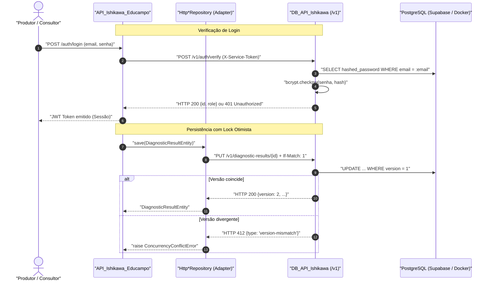

# Guia de Integração e Consumo do DB_API_Ishikawa (Épica 2)

> **Documento de Handoff:** Destinado aos desenvolvedores da `API_Ishikawa_Educampo` para a implementação dos adaptadores HTTP (`HttpProducerRepository`, `HttpConsultantRepository`, `HttpDiagnosticResultRepository`).  
> **Contrato Base:** Interfaces ABC em `API_Ishikawa_Educampo/app/contracts/repositories.py`  
> **Protocolo:** REST / JSON via rede interna  

---

## 1. Visão Geral da Arquitetura

O `DB_API_Ishikawa` é o serviço centralizado responsável pela **persistência relacional em PostgreSQL 16**, controle de concorrência com **lock otimista**, **hasheamento seguro de senhas (bcrypt)** e validação de credenciais.



---

## 2. Convenções Obrigatórias de Comunicação

### 2.1 Autenticação e Headers
Todas as requisições para a API `/v1` devem incluir:
- `X-Service-Token: <SERVICE_TOKEN>`: Token compartilhado de autenticação interna entre serviços.
- `Content-Type: application/json`

### 2.2 Controle de Concorrência (Lock Otimista)
- Toda entidade possui o campo `version: int`.
- Requisições de atualização (`PUT`) exigem o header `If-Match: <versao_atual>`.
- Se a versão no banco for diferente, o serviço responde `HTTP 412 Precondition Failed` com payload RFC 7807 (`type: "version-mismatch"`).
- Se `If-Match` for omitido em recurso existente que já possui versão, a requisição é rejeitada com `HTTP 428 Precondition Required`.

### 2.3 Tratamento de Erros Padronizado (RFC 7807)
Erros são retornados com `Content-Type: application/problem+json`:

```json
{
  "type": "version-mismatch",
  "title": "Conflito de Versao",
  "status": 412,
  "detail": "A versao fornecida no header If-Match (1) diverge da versao atual do registro (2).",
  "instance": "http://localhost:8002/v1/producers/..."
}
```

| Código HTTP | `type` RFC 7807 | Tradução recomendada no Adapter |
|---|---|---|
| `401` | `unauthorized` | `PersistenceUnavailableError` |
| `404` | `not-found` | Retornar `None`, `False` ou lançar `KeyError` conforme assinatura do método |
| `409` | `conflict-email` | Lançar `DuplicateEmailError` |
| `412` | `version-mismatch` | Lançar `ConcurrencyConflictError` |
| `422` | `validation-error` | Lançar `ValueError` ou erro de validação de schema |
| `503` | `unready` | `PersistenceUnavailableError` |

---

## 3. Catálogo de Endpoints REST (/v1)

### 3.1 Consultores (`/v1/consultants`)
- `POST /v1/consultants`: Cadastra consultor. Retorna `201 Created` sem senha hasheada.
- `GET /v1/consultants`: Listagem paginada (`?limit=50&offset=0`). Header de resposta: `X-Total-Count`.
- `GET /v1/consultants/{id}`: Detalhes do consultor, incluindo `producers_managed: list[UUID]` derivado dinamicamente da FK de produtores.
- `PUT /v1/consultants/{id}`: Atualiza consultor com `If-Match`.

### 3.2 Produtores (`/v1/producers`)
- `POST /v1/producers`: Cadastra produtor rural associado a um `consultant_id`. Retorna `201 Created`.
- `GET /v1/producers`: Listagem paginada (`?limit=50&offset=0`).
  - Filtro por e-mail: `GET /v1/producers?email=exemplo@fazenda.com`
  - Filtro por nome: `GET /v1/producers?nome=Fazenda%20Modelo` (deterministico: retorna o mais antigo se houver homônimos).
- `GET /v1/producers/{id}`: Busca por ID UUID. Retorna `200` ou `404`.
- `PUT /v1/producers/{id}`: Atualiza dados cadastrais e agronômicos (`dados` JSONB) com `If-Match`. Senha é imutável via `PUT`.
- `DELETE /v1/producers/{id}`: Exclusão com remoção em cascata (`CASCADE`) de diagnósticos associados. Retorna `204 No Content` ou `404`.

### 3.3 Resultados de Diagnóstico (`/v1/diagnostic-results`)
- `GET /v1/diagnostic-results/{producer_id}`: Retorna diagnóstico e simulação salvos para o produtor. Retorna `200 OK` ou `404 Not Found`.
- `PUT /v1/diagnostic-results/{producer_id}`: Operação de **Upsert**:
  - Se for a primeira criação: persiste registro com versão 1 e retorna `HTTP 201 Created`.
  - Se for atualização: exige `If-Match`, incrementa versão e retorna `HTTP 200 OK`.
  - Se produtor não existir: retorna `HTTP 404 Not Found`.

### 3.4 Autenticação (`/v1/auth/verify`)
- `POST /v1/auth/verify`: Valida e-mail e senha com bcrypt.
  - Payload: `{"email": "...", "password": "...", "role": "consultant"|"producer"}`
  - Sucesso: `HTTP 200 OK` com `{"id": "<UUID>", "role": "..."}`
  - Falha: `HTTP 401 Unauthorized` idêntico para usuário inexistente ou senha incorreta (anti-enumeração).

### 3.5 Saúde e Prontidão (`/health`)
- `GET /health/live`: Liveness probe (`HTTP 200 {"status": "alive"}`).
- `GET /health/ready`: Readiness probe executando `SELECT 1` no PostgreSQL (`HTTP 200 {"status": "ready", "database": "connected"}` ou `HTTP 503`).

---

## 4. Credenciais Mock de Desenvolvimento (Seed Data)

Quando o serviço inicializa com `SEED_ON_STARTUP=true` ou após rodar `python -m app.seed.import_farms`, as seguintes contas de teste ficam disponíveis:

1. **Consultor Padrão:**
   - E-mail: `consultor@educampo.com`
   - Senha: `admin123`
   - ID: `00000000-0000-0000-0000-000000000001`
2. **Produtores Rurais (farms.json):**
   - Senha padrão de todos os produtores mock: `produtor123`
   - Fazenda #1: `email_fazenda_1@gmail.com` (`b4fb2a6b-d57a-4f56-b261-9537a700a035`)
   - Fazenda #2: `email_fazenda_2@gmail.com` (`c8622ca4-5500-4591-bc45-e6839ddbe022`)
   - Fazenda #3: `email_fazenda_3@gmail.com` (`7ca8c07d-61d4-4f30-87ef-719c4bf34d1d`)
   - Fazenda #4: `email_fazenda_4@gmail.com` (`be2d07e3-9c08-430f-ade7-8607375c8eda`)
   - Fazenda #5: `email_fazenda_5@gmail.com` (`9120a31b-d4cb-422f-a16d-8dab888178cc`)

---

## 5. Blueprint de Implementação dos Adaptadores (Épica 2)

Na `API_Ishikawa_Educampo`, crie os adaptadores em `app/repositories/`:

```python
import httpx
from app.contracts.repositories import IProducerRepository
from app.domain.entities import ProducerEntity

class HttpProducerRepository(IProducerRepository):
    def __init__(self, base_url: str, token: str):
        self._client = httpx.Client(
            base_url=base_url,
            headers={"X-Service-Token": token},
            timeout=httpx.Timeout(connect=1.0, read=3.0, write=3.0, pool=5.0),
        )

    def find_by_id(self, producer_id: str) -> Optional[ProducerEntity]:
        response = self._client.get(f"/v1/producers/{producer_id}")
        if response.status_code == 404:
            return None
        response.raise_for_status()
        return ProducerEntity(**response.json())
```
