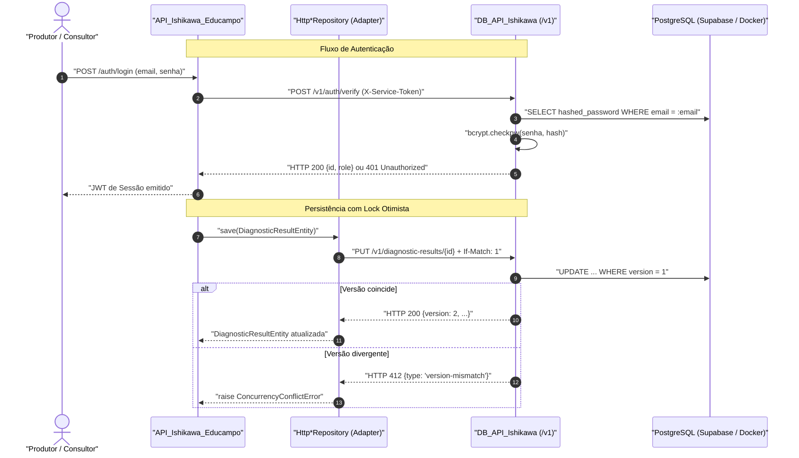

# Guia de Integração e Consumo do DB_API_Ishikawa (Épica 2)

> [!NOTE]
> **Documento de Handoff Técnico:** Destinado à equipe de desenvolvimento da `API_Ishikawa_Educampo` para a implementação e homologação dos adaptadores HTTP (`HttpProducerRepository`, `HttpConsultantRepository`, `HttpDiagnosticResultRepository`).
>
> *Ref: Obsidian notes [[sdd-db-api-ishikawa]], [[2026-10-07-supabase-managed-postgres-and-credential-ownership]] e [[epic-db-api-ishikawa-service]].*
>
> * **Contrato Base:** Interfaces ABC em `API_Ishikawa_Educampo/app/contracts/repositories.py`
> * **Protocolo:** REST / JSON via rede interna protegida por `X-Service-Token`
> * **Banco em Produção:** Supabase (PostgreSQL 16 gerenciado)

---

## 1. Visão Geral da Arquitetura

O `DB_API_Ishikawa` é o microserviço exclusivo de **persistência relacional em PostgreSQL 16**, controle de concorrência com **lock otimista**, **hasheamento seguro de senhas (bcrypt)** e validação de credenciais de login.



---

## 2. Convenções Obrigatórias de Comunicação

### 2.1 Autenticação Interna e Headers
Todas as requisições direcionadas para os endpoints `/v1` devem conter:
* `X-Service-Token: <SERVICE_TOKEN>`: Segredo compartilhado pré-configurado entre os microsserviços.
* `Content-Type: application/json`

### 2.2 Controle Otimista de Concorrência (`If-Match`)
* Todas as entidades persistidas possuem o campo `version: int` incremental.
* Em requisições de atualização (`PUT`), o cliente deve enviar o cabeçalho `If-Match: <versao_atual>`.
* **Conflito de Concorrência:** Se a versão gravada no banco for maior ou diferente da versão enviada, o serviço responde `HTTP 412 Precondition Failed` com `type: "version-mismatch"`.
* Se o recurso já existir e o cabeçalho `If-Match` for omitido, a API rejeita com `HTTP 428 Precondition Required`.

### 2.3 Tratamento de Erros Padronizado (RFC 7807)
Erros são retornados sob o formato `application/problem+json`:

```json
{
  "type": "version-mismatch",
  "title": "Conflito de Versao",
  "status": 412,
  "detail": "A versao fornecida no header If-Match (1) diverge da versao atual do registro (2).",
  "instance": "/v1/diagnostic-results/b4fb2a6b-d57a-4f56-b261-9537a700a035"
}
```

| Código HTTP | `type` RFC 7807 | Cenário | Ação Recomendada no Adaptador |
|---|---|---|---|
| `400` | `bad-request` | Parâmetros inválidos (ex.: `If-Match` não numérico) | Lançar `ValueError` |
| `401` | `unauthorized` | Token ausente, inválido ou credencial incorreta | Lançar `InvalidCredentialsError` ou `PersistenceUnavailableError` |
| `404` | `not-found` | Registro não encontrado | Retornar `None` ou lançar `KeyError` (conforme assinatura da interface) |
| `409` | `conflict-email` | Violação de unicidade de e-mail | Lançar `DuplicateEmailError` |
| `412` | `version-mismatch` | Conflito de versão (lock otimista) | Lançar `ConcurrencyConflictError` |
| `422` | `validation-error` | Falha de schema Pydantic | Lançar `ValueError` |
| `428` | `precondition-required` | `If-Match` ausente em recurso existente | Lançar `PreconditionRequiredError` |
| `503` | `unready` | Banco inacessível ou falha de conectividade | Lançar `PersistenceUnavailableError` |

---

## 3. Catálogo Detalhado de Endpoints REST (`/v1`)

### 3.1 Consultores (`/v1/consultants`)
* `POST /v1/consultants`: Cadastra novo consultor. Payload exige `id` (opcional/gerado), `nome`, `email`, `password`. Retorna `201 Created` sem a senha hasheada.
* `GET /v1/consultants`: Listagem paginada (`?limit=50&offset=0`). Header de resposta: `X-Total-Count`.
* `GET /v1/consultants/{id}`: Detalhes do consultor, incluindo o campo `producers_managed: list[UUID]` derivado dinamicamente das chaves estrangeiras dos produtores.
* `PUT /v1/consultants/{id}`: Atualiza `nome` do consultor. Exige cabeçalho `If-Match: <version>`.

### 3.2 Produtores Rurais (`/v1/producers`)
* `POST /v1/producers`: Cadastra produtor rural vinculado obrigatoriamente a um `consultant_id`. Payload com `id`, `email`, `password`, `nome`, `id_fazenda`, `dados` (JSONB) e `consultant_id`. Retorna `201 Created`.
* `GET /v1/producers`: Listagem paginada (`?limit=50&offset=0`).
  * Filtro por e-mail: `GET /v1/producers?email=produtor@fazenda.com`
  * Filtro por nome: `GET /v1/producers?nome=Fazenda%20Modelo` (determinização: retorna o mais antigo em caso de homônimos).
* `GET /v1/producers/{id}`: Busca por UUID. Retorna `200 OK` ou `404 Not Found`.
* `PUT /v1/producers/{id}`: Atualiza dados cadastrais (`nome`, `id_fazenda`, `dados`, `consultant_id`). Exige `If-Match: <version>`. Senha e e-mail permanecem estritamente imutáveis nesta rota.
* `DELETE /v1/producers/{id}`: Exclusão com remoção em cascata (`CASCADE`) de resultados de diagnósticos vinculados. Retorna `204 No Content` ou `404 Not Found`.

### 3.3 Resultados de Diagnóstico (`/v1/diagnostic-results`)
* `GET /v1/diagnostic-results/{producer_id}`: Retorna o diagnóstico agronômico e cenários de simulação salvos para o produtor. Retorna `200 OK` com `{producer_id, input_data, diagnostico, simulacao, version, updated_at}` ou `404 Not Found`.
* `PUT /v1/diagnostic-results/{producer_id}`: Operação de **Upsert Atômico**:
  * **Primeira Criação:** Persiste o registro com versão inicial `1` e retorna `HTTP 201 Created` (cabeçalho `If-Match` é opcional).
  * **Atualização Subsequente:** Exige `If-Match: <versao>`, incrementa a versão e retorna `HTTP 200 OK`.
  * Se o produtor não existir no banco: retorna `HTTP 404 Not Found`.

### 3.4 Autenticação e Gestão de Senhas (`/v1/auth`)
* `POST /v1/auth/verify`: Validação segura de credenciais de login.
  * Payload: `{"email": "...", "password": "...", "role": "consultant"|"producer"}`
  * Sucesso: `HTTP 200 OK` com `{"id": "<UUID>", "role": "..."}`
  * Falha: `HTTP 401 Unauthorized` uniforme para conta inexistente ou senha incorreta (defesa anti-enumeração).
* `POST /v1/auth/password`: Alteração de senha.
  * Payload: `{"role": "consultant"|"producer", "id": "<UUID>", "current_password": "...", "new_password": "..."}`
  * Sucesso: `HTTP 200 OK` com `{"id": "<UUID>", "role": "...", "message": "Senha atualizada com sucesso."}`
  * Falha: `HTTP 401 Unauthorized` caso a senha atual esteja incorreta.

### 3.5 Probes de Saúde (`/health`)
* `GET /health/live`: Liveness probe (`HTTP 200 {"status": "alive"}`).
* `GET /health/ready`: Readiness probe executando query ativa no PostgreSQL (`HTTP 200 {"status": "ready", "database": "connected"}` ou `HTTP 503 Service Unavailable`).

---

## 4. Credenciais Mock de Desenvolvimento (Seed Data)

Quando o serviço inicializa com `SEED_ON_STARTUP=true` ou após executar `python -m app.seed.import_farms`, os seguintes registros de teste ficam disponíveis para testes locais e de homologação:

1. **Consultor Padrão:**
   * E-mail: `consultor@educampo.com`
   * Senha: `admin123`
   * ID: `00000000-0000-0000-0000-000000000001`
2. **Produtores Rurais Mock (farms.json):**
   * Senha padrão de todos os produtores mock: `produtor123`
   * Produtor 1: `email_fazenda_1@gmail.com` (`b4fb2a6b-d57a-4f56-b261-9537a700a035`)
   * Produtor 2: `email_fazenda_2@gmail.com` (`c8622ca4-5500-4591-bc45-e6839ddbe022`)
   * Produtor 3: `email_fazenda_3@gmail.com` (`7ca8c07d-61d4-4f30-87ef-719c4bf34d1d`)
   * Produtor 4: `email_fazenda_4@gmail.com` (`be2d07e3-9c08-430f-ade7-8607375c8eda`)
   * Produtor 5: `email_fazenda_5@gmail.com` (`9120a31b-d4cb-422f-a16d-8dab888178cc`)

---

## 5. Blueprint de Implementação dos Adaptadores (Épica 2)

Abaixo estão as implementações de referência completas a serem adicionadas na `API_Ishikawa_Educampo` no diretório `app/repositories/`.

### 5.1 Adaptador de Produtores (`HttpProducerRepository`)

```python
# app/repositories/http_producer_repository.py
from typing import List, Optional
import httpx

from app.contracts.repositories import IProducerRepository
from app.domain.entities import ProducerEntity
from app.core.exceptions import (
    DuplicateEmailError,
    ConcurrencyConflictError,
    PersistenceUnavailableError,
)

class HttpProducerRepository(IProducerRepository):
    def __init__(self, base_url: str, token: str, timeout: float = 5.0):
        self._client = httpx.Client(
            base_url=base_url,
            headers={
                "X-Service-Token": token,
                "Content-Type": "application/json",
            },
            timeout=httpx.Timeout(connect=1.0, read=timeout, write=timeout, pool=5.0),
        )

    def initialize(self) -> None:
        """Verifica prontidão do serviço DB_API."""
        try:
            res = self._client.get("/health/ready")
            if res.status_code != 200:
                raise PersistenceUnavailableError("DB_API_Ishikawa não está pronto.")
        except httpx.HTTPError as err:
            raise PersistenceUnavailableError(f"Falha de conexão com DB_API: {err}")

    def is_initialized(self) -> bool:
        try:
            return self._client.get("/health/ready").status_code == 200
        except httpx.HTTPError:
            return False

    def get_all(self) -> List[ProducerEntity]:
        res = self._client.get("/v1/producers?limit=200")
        res.raise_for_status()
        return [ProducerEntity(**item) for item in res.json()]

    def find_by_id(self, producer_id: str) -> Optional[ProducerEntity]:
        res = self._client.get(f"/v1/producers/{producer_id}")
        if res.status_code == 404:
            return None
        res.raise_for_status()
        return ProducerEntity(**res.json())

    def find_by_email(self, email: str) -> Optional[ProducerEntity]:
        res = self._client.get("/v1/producers", params={"email": email})
        if res.status_code == 404:
            return None
        res.raise_for_status()
        data = res.json()
        if isinstance(data, list):
            return ProducerEntity(**data[0]) if data else None
        return ProducerEntity(**data)

    def find_by_name(self, nome: str) -> Optional[ProducerEntity]:
        res = self._client.get("/v1/producers", params={"nome": nome})
        if res.status_code == 404:
            return None
        res.raise_for_status()
        data = res.json()
        if isinstance(data, list):
            return ProducerEntity(**data[0]) if data else None
        return ProducerEntity(**data)

    def create(self, producer: ProducerEntity) -> ProducerEntity:
        payload = producer.model_dump(mode="json")
        res = self._client.post("/v1/producers", json=payload)
        if res.status_code == 409:
            raise DuplicateEmailError(f"Email {producer.email} já cadastrado.")
        res.raise_for_status()
        return ProducerEntity(**res.json())

    def update(self, producer: ProducerEntity) -> ProducerEntity:
        payload = {
            "nome": producer.nome,
            "id_fazenda": producer.id_fazenda,
            "dados": producer.dados,
            "consultant_id": str(producer.consultant_id) if producer.consultant_id else None,
        }
        headers = {"If-Match": str(getattr(producer, "version", 1))}
        res = self._client.put(f"/v1/producers/{producer.id}", json=payload, headers=headers)
        if res.status_code == 404:
            raise KeyError(f"Produtor {producer.id} não encontrado.")
        if res.status_code == 412:
            raise ConcurrencyConflictError("Conflito de versão ao atualizar produtor.")
        res.raise_for_status()
        return ProducerEntity(**res.json())

    def delete(self, producer_id: str) -> bool:
        res = self._client.delete(f"/v1/producers/{producer_id}")
        if res.status_code == 404:
            return False
        return res.status_code == 204
```

---

### 5.2 Adaptador de Resultados de Diagnóstico (`HttpDiagnosticResultRepository`)

```python
# app/repositories/http_diagnostic_result_repository.py
from typing import Optional
import httpx

from app.contracts.repositories import IDiagnosticResultRepository
from app.domain.entities import DiagnosticResultEntity
from app.core.exceptions import (
    ConcurrencyConflictError,
    PersistenceUnavailableError,
)

class HttpDiagnosticResultRepository(IDiagnosticResultRepository):
    def __init__(self, base_url: str, token: str, timeout: float = 5.0):
        self._client = httpx.Client(
            base_url=base_url,
            headers={
                "X-Service-Token": token,
                "Content-Type": "application/json",
            },
            timeout=httpx.Timeout(connect=1.0, read=timeout, write=timeout, pool=5.0),
        )

    def initialize(self) -> None:
        try:
            res = self._client.get("/health/ready")
            if res.status_code != 200:
                raise PersistenceUnavailableError("DB_API_Ishikawa não está pronto.")
        except httpx.HTTPError as err:
            raise PersistenceUnavailableError(f"Falha de conexão com DB_API: {err}")

    def is_initialized(self) -> bool:
        try:
            return self._client.get("/health/ready").status_code == 200
        except httpx.HTTPError:
            return False

    def find_by_producer_id(self, producer_id: str) -> Optional[DiagnosticResultEntity]:
        res = self._client.get(f"/v1/diagnostic-results/{producer_id}")
        if res.status_code == 404:
            return None
        res.raise_for_status()
        return DiagnosticResultEntity(**res.json())

    def save(self, diagnostic_result: DiagnosticResultEntity) -> DiagnosticResultEntity:
        producer_id = str(diagnostic_result.producer_id)
        payload = {
            "input_data": diagnostic_result.input_data,
            "diagnostico": diagnostic_result.diagnostico,
            "simulacao": diagnostic_result.simulacao,
        }
        headers = {}
        # Envia If-Match se a entidade já tiver sido carregada com versão prévia
        current_version = getattr(diagnostic_result, "version", None)
        if current_version is not None:
            headers["If-Match"] = str(current_version)

        res = self._client.put(
            f"/v1/diagnostic-results/{producer_id}",
            json=payload,
            headers=headers,
        )
        if res.status_code == 412:
            raise ConcurrencyConflictError(
                f"Conflito de versão no diagnóstico do produtor {producer_id}."
            )
        if res.status_code == 404:
            raise KeyError(f"Produtor {producer_id} não encontrado para vínculo do diagnóstico.")
        res.raise_for_status()
        return DiagnosticResultEntity(**res.json())
```

---

### 5.3 Adaptador de Consultores (`HttpConsultantRepository`)

```python
# app/repositories/http_consultant_repository.py
from typing import List, Optional
import httpx

from app.contracts.repositories import IConsultantRepository
from app.domain.entities import ConsultantEntity
from app.core.exceptions import DuplicateEmailError, PersistenceUnavailableError

class HttpConsultantRepository(IConsultantRepository):
    def __init__(self, base_url: str, token: str, timeout: float = 5.0):
        self._client = httpx.Client(
            base_url=base_url,
            headers={
                "X-Service-Token": token,
                "Content-Type": "application/json",
            },
            timeout=httpx.Timeout(connect=1.0, read=timeout, write=timeout, pool=5.0),
        )

    def initialize(self) -> None:
        try:
            res = self._client.get("/health/ready")
            if res.status_code != 200:
                raise PersistenceUnavailableError("DB_API_Ishikawa indisponível.")
        except httpx.HTTPError as err:
            raise PersistenceUnavailableError(f"Erro de conexão com DB_API: {err}")

    def is_initialized(self) -> bool:
        try:
            return self._client.get("/health/ready").status_code == 200
        except httpx.HTTPError:
            return False

    def get_all(self) -> List[ConsultantEntity]:
        res = self._client.get("/v1/consultants?limit=200")
        res.raise_for_status()
        return [ConsultantEntity(**item) for item in res.json()]

    def find_by_id(self, consultant_id: str) -> Optional[ConsultantEntity]:
        res = self._client.get(f"/v1/consultants/{consultant_id}")
        if res.status_code == 404:
            return None
        res.raise_for_status()
        return ConsultantEntity(**res.json())

    def find_by_email(self, email: str) -> Optional[ConsultantEntity]:
        res = self._client.get("/v1/consultants", params={"email": email})
        if res.status_code == 404:
            return None
        res.raise_for_status()
        data = res.json()
        if isinstance(data, list):
            return ConsultantEntity(**data[0]) if data else None
        return ConsultantEntity(**data)

    def create(self, consultant: ConsultantEntity) -> ConsultantEntity:
        payload = consultant.model_dump(mode="json")
        res = self._client.post("/v1/consultants", json=payload)
        if res.status_code == 409:
            raise DuplicateEmailError(f"Email {consultant.email} já cadastrado.")
        res.raise_for_status()
        return ConsultantEntity(**res.json())

    def update(self, consultant: ConsultantEntity) -> ConsultantEntity:
        payload = {"nome": consultant.nome}
        headers = {"If-Match": str(getattr(consultant, "version", 1))}
        res = self._client.put(f"/v1/consultants/{consultant.id}", json=payload, headers=headers)
        if res.status_code == 404:
            raise KeyError(f"Consultor {consultant.id} não encontrado.")
        res.raise_for_status()
        return ConsultantEntity(**res.json())
```

---

### 5.4 Cliente de Autenticação (`AuthClient`)

```python
# app/services/auth_client.py
from typing import Optional, Tuple
from uuid import UUID
import httpx

class AuthClient:
    """Cliente para verificação de credenciais e alteração de senhas no DB_API."""

    def __init__(self, base_url: str, token: str, timeout: float = 3.0):
        self._client = httpx.Client(
            base_url=base_url,
            headers={
                "X-Service-Token": token,
                "Content-Type": "application/json",
            },
            timeout=httpx.Timeout(connect=1.0, read=timeout, write=timeout, pool=5.0),
        )

    def verify_credentials(
        self, email: str, password: str, role: str
    ) -> Optional[Tuple[UUID, str]]:
        """Verifica email e senha. Retorna (user_id, role) se válido, ou None se inválido."""
        payload = {"email": email, "password": password, "role": role}
        res = self._client.post("/v1/auth/verify", json=payload)
        if res.status_code == 401:
            return None
        res.raise_for_status()
        data = res.json()
        return UUID(data["id"]), data["role"]

    def change_password(
        self, role: str, user_id: UUID, current_password: str, new_password: str
    ) -> bool:
        """Altera a senha do usuário verificando a senha atual."""
        payload = {
            "role": role,
            "id": str(user_id),
            "current_password": current_password,
            "new_password": new_password,
        }
        res = self._client.post("/v1/auth/password", json=payload)
        return res.status_code == 200
```

---

## 6. Boas Práticas e Resiliência na Integração

1. **Configuração de Timeouts:**
   * Nunca utilize chamadas sem timeout. Configure `connect=1.0s` e `read=3.0s` para evitar esgotamento de threads/event loop no cliente.
2. **Tratamento de Lock Otimista (HTTP 412):**
   * Ao capturar `ConcurrencyConflictError`, a `API_Ishikawa_Educampo` **não deve** realizar retry cego imediato com a mesma versão. Ela deve recarregar a versão mais recente da entidade, re-executar a mesclagem ou notificar o usuário com uma mensagem de conflito amigável.
3. **Isolamento de Credenciais:**
   * A `API_Ishikawa_Educampo` não armazena strings de conexão ao Supabase nem manipula colunas de hash de senha. Ela interage única e exclusivamente através de `POST /v1/auth/verify` e dos repositórios HTTP.
