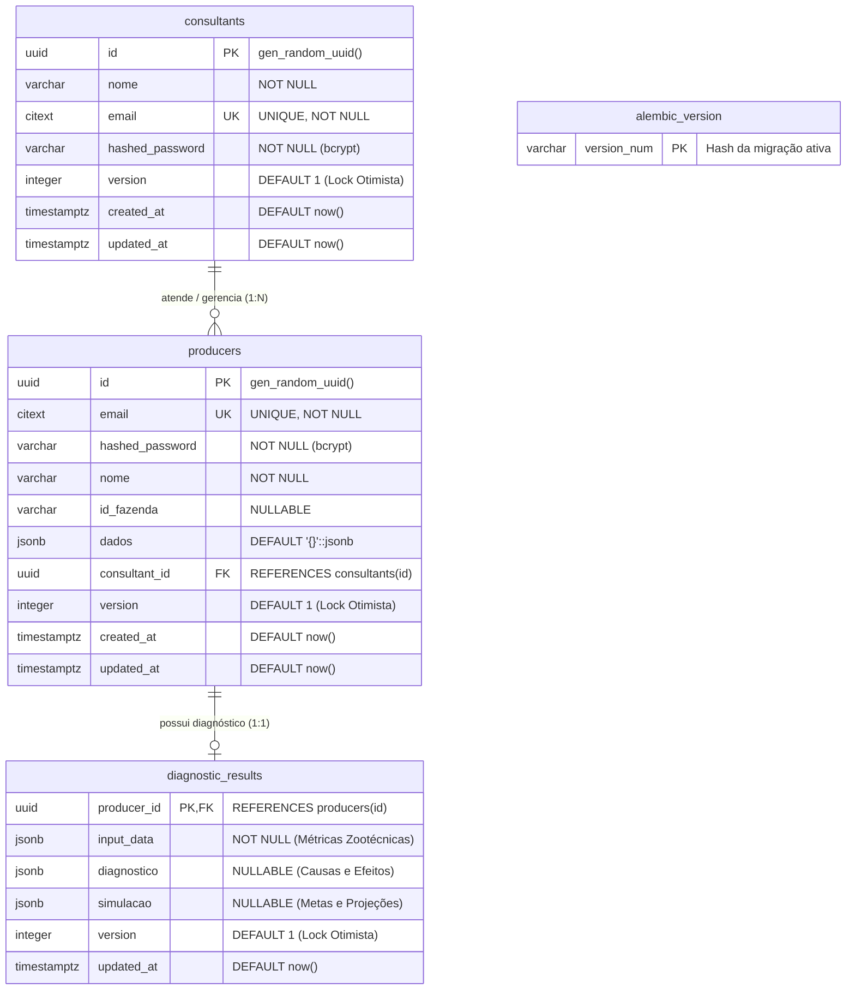

# Arquitetura e Modelagem do Banco de Dados (Supabase PostgreSQL 16)

> [!NOTE]
> **Propósito do Documento:**
> Este documento fornece a especificação técnica exaustiva do esquema relacional mantido no **Supabase (PostgreSQL 16)** para o microserviço `DB_API_Ishikawa`. Ele serve como guia definitivo para desenvolvedores, arquitetos e engenheiros de dados compreenderem a topologia de tabelas, tipos de dados, chaves estrangeiras, índices estratégicos, segurança via Row Level Security (RLS) e o mecanismo de controle otimista de concorrência.
>
> *Ref: Decisões arquiteturais [[2026-10-07-supabase-managed-postgres-and-credential-ownership]], [[sdd-db-api-producers]], [[sdd-db-api-skeleton-consultants]] e [[sdd-db-api-password-management]].*

---

## 1. Diagrama Visual de Entidade-Relacionamento e Classes (ERD)

Abaixo encontra-se a modelagem visual das entidades relacionais, indicando tipos estritos, chaves primárias, estrangeiras e cardinalidades.

### 1.1 Diagrama Renderizado (Imagem PNG)

---

### 1.2 Diagrama Mermaid Interativo

---

## 2. Dicionário de Dados e Especificação de Tabelas

### 2.1 Tabela `public.consultants`
Armazena o cadastro dos consultores técnicos que atendem os produtores de leite no ecossistema Educampo.

| Coluna | Tipo de Dado | Nulidade | Valor Padrão | Descrição & Regras de Negócio |
| :--- | :--- | :---: | :--- | :--- |
| `id` | `UUID` | **NOT NULL** | `gen_random_uuid()` | Chave Primária identificadora única do consultor. |
| `nome` | `VARCHAR(255)` | **NOT NULL** | - | Nome completo do consultor técnico. |
| `email` | `CITEXT` | **NOT NULL** | - | Endereço de e-mail único. Usa extensão `citext` para buscas e comparações *case-insensitive*. |
| `hashed_password` | `VARCHAR(255)` | **NOT NULL** | - | Hash criptográfico seguro salgado com **bcrypt**. Jamais retornado em respostas de API. |
| `version` | `INTEGER` | **NOT NULL** | `1` | Controle otimista de concorrência. Incrementado a cada atualização cadastral. |
| `created_at` | `TIMESTAMPTZ` | **NOT NULL** | `now()` | Timestamp de registro no fuso UTC. |
| `updated_at` | `TIMESTAMPTZ` | **NOT NULL** | `now()` | Timestamp da última atualização no fuso UTC. |

---

### 2.2 Tabela `public.producers`
Armazena os produtores rurais e suas respectivas fazendas leiteiras vinculadas.

| Coluna | Tipo de Dado | Nulidade | Valor Padrão | Descrição & Regras de Negócio |
| :--- | :--- | :---: | :--- | :--- |
| `id` | `UUID` | **NOT NULL** | `gen_random_uuid()` | Chave Primária identificadora única do produtor. |
| `email` | `CITEXT` | **NOT NULL** | - | E-mail de login único do produtor (*case-insensitive* via `citext`). |
| `hashed_password` | `VARCHAR(255)` | **NOT NULL** | - | Hash criptográfico bcrypt da credencial do produtor. |
| `nome` | `VARCHAR(255)` | **NOT NULL** | - | Nome da fazenda / produtor. Indexado via expressão funcional `lower(nome)` para busca rápida. |
| `id_fazenda` | `VARCHAR(255)` | `NULLABLE` | `NULL` | Identificador alfanumérico legado ou externo da propriedade. |
| `dados` | `JSONB` | **NOT NULL** | `'{}'::jsonb` | Payload zootécnico flexível (ex: `ccs`, `producao_vaca`, `sistema_producao`, `area_atividade`, etc.). |
| `consultant_id` | `UUID` | `NULLABLE` | `NULL` | Chave Estrangeira referenciando `public.consultants(id)`. |
| `version` | `INTEGER` | **NOT NULL** | `1` | Versão de controle concorrente otimista (`If-Match`). |
| `created_at` | `TIMESTAMPTZ` | **NOT NULL** | `now()` | Timestamp de criação em UTC. |
| `updated_at` | `TIMESTAMPTZ` | **NOT NULL** | `now()` | Timestamp da última modificação em UTC. |

---

### 2.3 Tabela `public.diagnostic_results`
Armazena a consolidação analítica e persistente de diagnósticos Ishikawa e simulações zootécnicas.

| Coluna | Tipo de Dado | Nulidade | Valor Padrão | Descrição & Regras de Negócio |
| :--- | :--- | :---: | :--- | :--- |
| `producer_id` | `UUID` | **NOT NULL** | - | **PK e FK simultânea:** Relacionamento 1:1 estrito com `public.producers(id)`. |
| `input_data` | `JSONB` | **NOT NULL** | - | Snapshot das variáveis zootécnicas e parâmetros de entrada utilizados no diagnóstico. |
| `diagnostico` | `JSONB` | `NULLABLE` | `NULL` | Estrutura de causas-raiz Ishikawa e classificação zootécnica de gargalos. |
| `simulacao` | `JSONB` | `NULLABLE` | `NULL` | Metas simuladas, curvas de projeção e cenários gerados pelo motor ML. |
| `version` | `INTEGER` | **NOT NULL** | `1` | Controle otimista de concorrência (`If-Match`). |
| `updated_at` | `TIMESTAMPTZ` | **NOT NULL** | `now()` | Timestamp da última atualização ou recálculo do diagnóstico. |

---

### 2.4 Tabela `public.alembic_version`
Gerenciada automaticamente pelo framework Alembic para versionamento determinístico de migrações DDL.

| Coluna | Tipo de Dado | Nulidade | Descrição |
| :--- | :--- | :---: | :--- |
| `version_num` | `VARCHAR(32)` | **NOT NULL** | Identificador de revisão ativo (Ex: `005_move_citext_to_extensions`). |

---

## 3. Chaves Estrangeiras e Relacionamentos

| Nome da Restrição (Constraint) | Tabela Origem | Coluna Origem | Tabela Destino | Coluna Destino | Regra ON DELETE |
| :--- | :--- | :--- | :--- | :--- | :--- |
| `fk_producers_consultant_id_consultants` | `producers` | `consultant_id` | `consultants` | `id` | `SET NULL` / Restrito |
| `fk_diagnostic_results_producer_id_producers` | `diagnostic_results` | `producer_id` | `producers` | `id` | `CASCADE` |

---

## 4. Estratégia de Índices e Performance

Todos os índices foram auditados e projetados para evitar redundâncias, garantindo planos de execução `Index Scan` de alta performance:

| Tabela | Nome do Índice | Tipo | Definição SQL | Propósito |
| :--- | :--- | :---: | :--- | :--- |
| `consultants` | `pk_consultants` | B-tree | `UNIQUE (id)` | Busca direta por chave primária UUID. |
| `consultants` | `uq_consultants_email` | B-tree | `UNIQUE (email)` | Garantia de unicidade de login sem duplicidade. |
| `producers` | `pk_producers` | B-tree | `UNIQUE (id)` | Busca direta por chave primária UUID. |
| `producers` | `uq_producers_email` | B-tree | `UNIQUE (email)` | Unicidade de credencial de produtor. |
| `producers` | `ix_producers_consultant_id` | B-tree | `INDEX (consultant_id)` | Otimização da listagem de fazendas filtradas por consultor. |
| `producers` | `ix_producers_lower_nome` | B-tree | `INDEX (lower((nome)::text))` | Busca textual e autocomplete de fazendas sem degradação. |
| `diagnostic_results` | `pk_diagnostic_results` | B-tree | `UNIQUE (producer_id)` | Acesso `O(1)` ao diagnóstico da fazenda. |
| `alembic_version` | `alembic_version_pkc` | B-tree | `UNIQUE (version_num)` | Controle de integridade de versão. |

---

## 5. Diretrizes de Segurança e Governança (Supabase)

### 5.1 Extensão `citext` no Schema `extensions`
Conforme as boas práticas oficiais do Supabase (Migration 005), extensões PostgreSQL nunca residem no schema `public`. A extensão `citext` reside no schema `extensions`, garantindo segurança e compatibilidade com o pooler Supavisor.

### 5.2 Row Level Security (RLS)
Todas as tabelas do schema `public` possuem **RLS ATIVADO (`rls_enabled = true`)** com política explícita de negação (*explicit deny*):
* Nenhuma chave pública anônima (`anon_key`) do Supabase consegue efetuar `SELECT`, `INSERT`, `UPDATE` ou `DELETE`.
* O acesso é concedido **exclusivamente via conexão relacional autenticada (Session Mode / Transaction Pooler)** utilizada pelo `DB_API_Ishikawa`.

### 5.3 Isolamento de Senhas e Hashes (bcrypt)
* Hashes de senha são gerados com custo de trabalho (*work factor*) padrão do bcrypt.
* Nenhuma rota HTTP da API retorna a coluna `hashed_password`.
* As verificações de credenciais (`POST /v1/auth/verify`) executam comparação em tempo constante contra ataques de análise temporal (*timing attacks*).

### 5.4 Controle Otimista de Concorrência
* A coluna `version` assegura que duas instâncias concorrentes não sobrescrevam diagnósticos desavisadamente.
* O cliente envia `If-Match: <version>`. Se o registro no banco tiver versão divergente, o banco não atualiza e a API responde `HTTP 412 Precondition Failed`.

---

## 🔗 Rastreabilidade e Documentos Relacionados
* [Guia de Integração e Consumo do DB_API](file:///e:/Codigos/Educampo/DB_API_Ishikawa/docs/client_integration_guide.md)
* [Arquitetura de Componentes da API](file:///e:/Codigos/Educampo/DB_API_Ishikawa/docs/api_architecture_and_components.md)
* [Fluxos e Diagramas de Sequência](file:///e:/Codigos/Educampo/DB_API_Ishikawa/docs/integration_sequence_flows.md)
