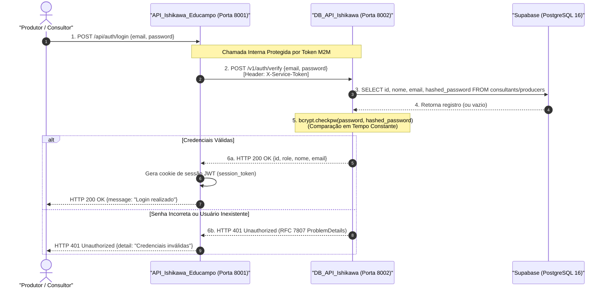
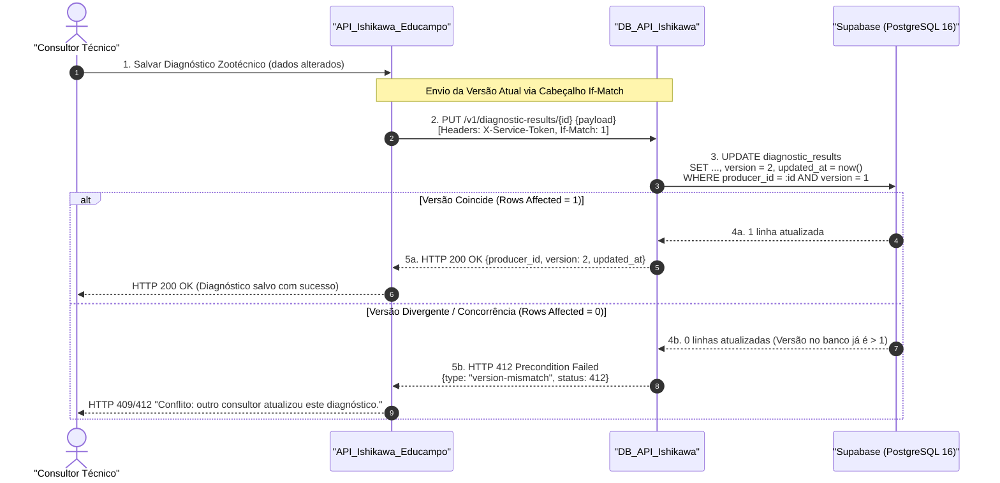
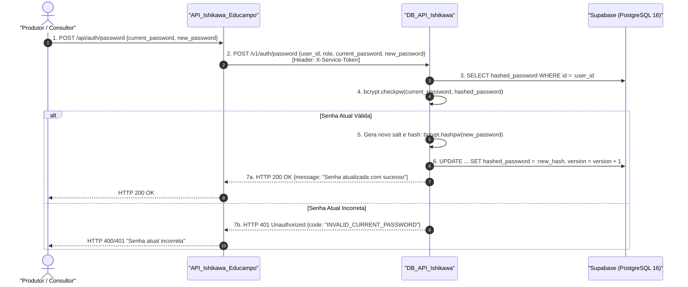
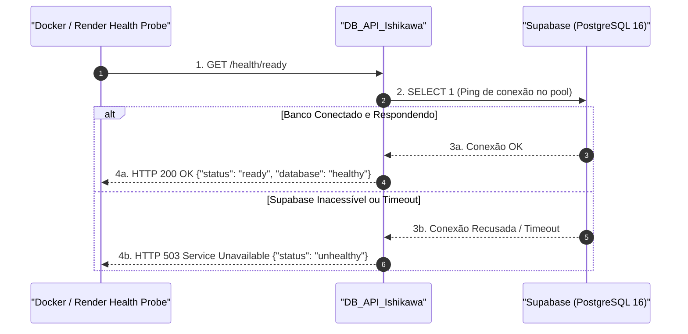

# Diagramas de Sequência e Fluxos de Integração Inter-serviços

> [!NOTE]
> **Visão de Fluxo M2M:**
> Este documento detalha a dinâmica temporal e a troca de mensagens entre a `API_Ishikawa_Educampo` e o microsserviço `DB_API_Ishikawa`. Ele abrange os cenários críticos de autenticação de credenciais, atualização segura de senhas, persistência sob concorrência otimista e verificação de prontidão (*healthcheck*).
>
> *Ref: [[sdd-db-api-ishikawa]], [[sdd-db-api-password-management]] e [[db-api-integration]].*

---

## 1. Visão Geral dos Fluxos Críticos

O diagrama abaixo apresenta visualmente os dois principais fluxos da arquitetura: validação de credenciais (sem exposição de hashes) e persistência com controle otimista de concorrência.

### 1.1 Diagrama Renderizado (Imagem PNG)

---

## 2. Fluxo 1: Autenticação de Usuário e Verificação de Credenciais

### 2.1 Diagrama Mermaid Interativo

### 2.2 Princípios de Segurança Aplicados
* **Ocultação Absoluta do Hash:** O campo `hashed_password` é recuperado pelo DB_API do banco e consumido unicamente em memória para o cálculo do `bcrypt`. Ele **nunca** é enviado de volta para a `API_Ishikawa_Educampo`.
* **Defesa contra Ataques de Temporização:** Caso o e-mail não seja encontrado no banco, o DB_API executa um cálculo de verificação contra um hash falso pré-computado, garantindo que o tempo de resposta seja indistinguível entre usuário inexistente e senha incorreta.

---

## 3. Fluxo 2: Persistência com Controle Otimista de Concorrência

### 3.1 Diagrama Mermaid Interativo

---

## 4. Fluxo 3: Atualização Segura de Senha (`POST /v1/auth/password`)

---

## 5. Fluxo 4: Sonda de Prontidão e Startup (`GET /health/ready`)

---

## 🔗 Documentos Relacionados
* [Arquitetura das Tabelas do Supabase](file:///e:/Codigos/Educampo/DB_API_Ishikawa/docs/database_schema_architecture.md)
* [Arquitetura de Componentes da API](file:///e:/Codigos/Educampo/DB_API_Ishikawa/docs/api_architecture_and_components.md)
* [Guia de Integração e Consumo do DB_API](file:///e:/Codigos/Educampo/DB_API_Ishikawa/docs/client_integration_guide.md)
