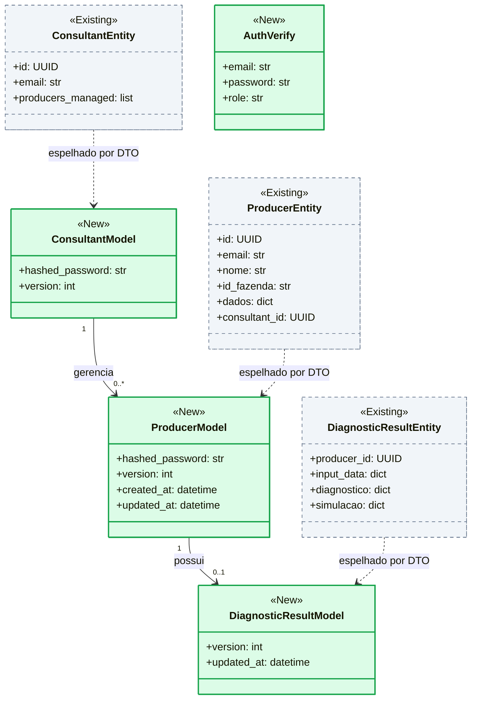
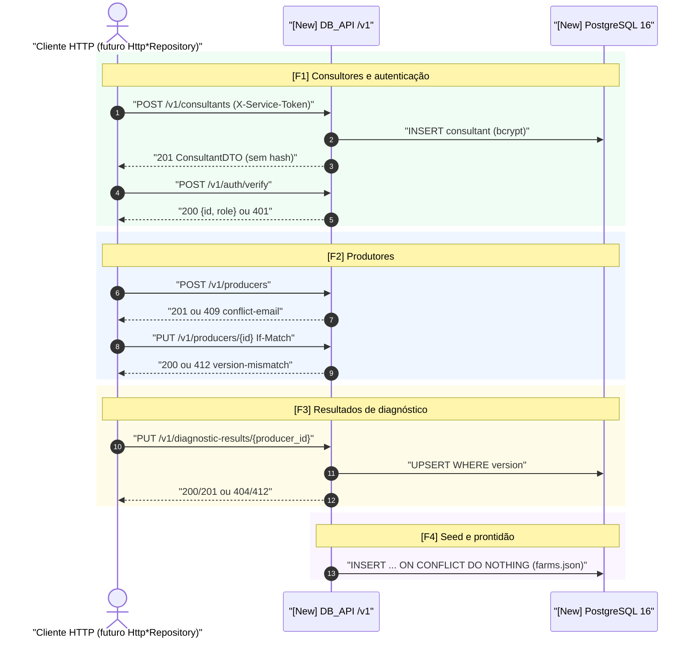
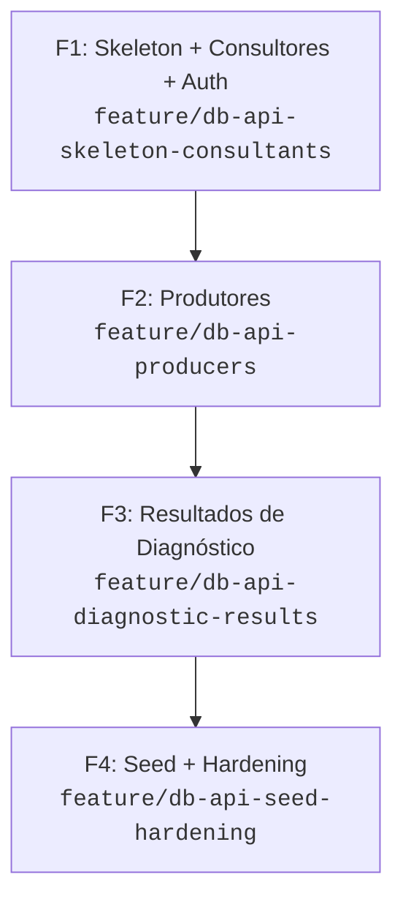

# Epic Blueprint: Serviço de Persistência DB_API_Ishikawa

## 1. Problem & Desired Observable Outcome

### Current State & Problem
A `API_Ishikawa_Educampo` persiste dados de forma simulada: Redis (produtores, resultados) com fallback silencioso em memória, e in-memory (consultores). O Redis é dívida técnica (ADR `2026-08-13-redis-as-transient-storage-pending-real-db`). Não há banco real, nem lock de concorrência, nem paginação.

### Affected Users or Systems
- `API_Ishikawa_Educampo` (futuro consumidor via adapters `Http*Repository`, épica posterior).
- Consultores e produtores (dados de cadastro, login e diagnóstico).

### Desired Observable Outcome
Um serviço `DB_API_Ishikawa` independente, em Docker, com API REST `/v1` cujo contrato espelha 1:1 as interfaces ABC atuais (`IProducerRepository`, `IConsultantRepository`, `IDiagnosticResultRepository`), pronto para ser consumido sem alterar services/rotas/worker da API Ishikawa. O PostgreSQL 16 roda em **Docker em dev/CI** e no **Supabase (apenas Postgres gerenciado) em staging/prod**, trocando só a `DATABASE_URL`.

### Status Atual (2026-10-07)
| Fase | Estado |
|---|---|
| F1 Skeleton + Consultores + Auth | ✅ Implementada |
| F2 Produtores | ✅ Implementada |
| F3 Resultados de Diagnóstico | 🔄 Planejamento (branch `feature/db-api-diagnostic-results`) |
| F4 Seed + Hardening + Deploy Supabase | ⏳ Pendente |

### Epic Success Criteria

| ID | Verifiable Outcome | Validation Method |
|---|---|---|
| S1 | Todos os endpoints do mapeamento §5.1 da spec respondem conforme contrato (sucesso e erros RFC 7807) | Suíte de testes de contrato HTTP contra Postgres real (testcontainers) |
| S2 | `hashed_password` nunca aparece em nenhuma resposta; login só via `POST /v1/auth/verify` | Testes de contrato + inspeção de schemas de saída |
| S3 | Lock otimista: `PUT` com `If-Match` desatualizado retorna 412 | Teste de concorrência (2 updates com mesma versão) |
| S4 | Seed do `farms.json` é idempotente (2 execuções = mesmo estado) | Teste de integração do import |
| S5 | Latência p95 < 50 ms por operação na rede Docker interna | Baseline medido por script de carga simples (sem inventar número antes de medir) |
| S6 | `docker compose up` sobe `postgres` + `db-api` saudáveis (`/health/ready`) | Smoke test no CI |
| S7 | A mesma imagem do `db-api` roda no Render contra o Supabase mudando apenas `DATABASE_URL`; `alembic upgrade head` aplica o schema | Smoke test em staging |
| S8 | Tabelas do Supabase com RLS ativo e sem policies (a `anon key` não lê hashes) | Verificação manual/SQL no dashboard |

---

## 2. Scope & Boundaries

### In-Scope
- Repositório `DB_API_Ishikawa` completo: FastAPI, SQLAlchemy 2.0, Alembic, Pydantic v2, Docker/compose, CI.
- Recursos: consultants, producers, diagnostic-results, auth/verify, health.
- Seed idempotente do `farms.json` e consultores mock.
- Decisões D1–D19 da spec (D15–D19: Supabase, auth, ambientes, pooler, RLS).
- Preparação para Supabase (F4): settings de pool/`prepare_threshold`, migração de RLS, documentação de deploy no Render.

### Out-of-Scope (Non-Goals)
- **Migração na `API_Ishikawa_Educampo`** (adapters `Http*`, flag `PERSISTENCE_BACKEND`, fail-fast D14 no lado cliente, remoção do Redis): **épica seguinte** (fases M0–M6 da spec).
- Suíte de contrato M0 parametrizada (InMemory/Redis/Http) e fix do bug `producers_managed` em `GET /auth/me`: ambos vivem na API Ishikawa → **itens de handoff da épica seguinte** (ver §9).
- Migração de dados Redis/memória (decisão já tomada: não migrar).
- `diagnostic_history`, normalização de `dados`, JWT/mTLS, async (spec §9).
- **Supabase Auth, supabase-py, PostgREST, Storage e Realtime** (D15): Supabase é só Postgres gerenciado; a autenticação continua no DB_API (hash bcrypt) + JWT na API Ishikawa (D16).
- Supabase CLI local (D17): dev continua em Docker.
- Troca de senha (senha é imutável no `PUT /v1/producers/{id}`; endpoint dedicado fica para depois — ver `notas.md`).

### Constraints
- Contrato REST 1:1 com interfaces ABC; IDs UUID gerados pelo cliente.
- Repositório pessoal agora; mover para `Educampo-UFV` depois.
- Cada feature cabe em 1 chat e é mergeada em `develop` sob CI.

---

## 3. Architectural Context & Decisions

### Relevant Existing State
- Interfaces ABC em `API_Ishikawa_Educampo/app/contracts/repositories.py` e entidades em `app/domain/entities.py` (fonte de verdade do contrato).
- Seed atual: `RedisProducerRepository._load_seed_if_empty()` e `InMemoryConsultantRepository`.

### Structural Domain Delta (Class Diagram)



### Macro Business Journey (Sequence Diagram)



### Proposed High-Level Approach
Fatias verticais por recurso sobre um esqueleto mínimo: F1 entrega skeleton + consultores + auth; F2 produtores; F3 resultados; F4 seed e hardening. Cada fatia traz modelo, migration Alembic, rotas e testes contra Postgres real desde o início (sem adiar o adapter real).

### Invariants to Preserve
- Semântica das interfaces ABC (`None`/`False`/`KeyError` mapeados no contrato HTTP).
- `API_Ishikawa_Educampo` permanece inalterada nesta épica.

### References & ADRs
- [feature_spec_db_api_ishikawa.md](file:///e:/Codigos/Educampo/DB_API_Ishikawa/feature_spec_db_api_ishikawa.md) · [feature_roadmap_persistencia_incremental.md](file:///e:/Codigos/Educampo/DB_API_Ishikawa/feature_roadmap_persistencia_incremental.md)
- `[[sdd-db-api-ishikawa]]`, `[[sdd-mock-persistence-layer]]`
- ADR `2026-08-13-redis-as-transient-storage-pending-real-db`

---

## 4. Shared Boundary Contracts

| ID | Contract / Boundary | Relevant Guarantees | Introduced In | Consumed By |
|---|---|---|---|---|
| C1 | Convenções transversais: `X-Service-Token`, RFC 7807, paginação (`limit` ≤ 200, `X-Total-Count`), `version`/`If-Match` | Erros previsíveis; 401 sem token; 422 limit > 200 | F1 | F2, F3, F4 |
| C2 | Consultants API + `POST /v1/auth/verify` | Hash nunca exposto; 401 idêntico p/ email inexistente | F1 | F2 (role producer), épica seguinte |
| C3 | Producers API | 409 email duplicado; 412 version; `find_by_name` determinístico (mais antigo) | F2 | F3, F4, épica seguinte |
| C4 | DiagnosticResults API | Upsert 1/produtor; 404 produtor inexistente; cascade delete | F3 | F4, épica seguinte |
| C5 | Seed idempotente + `/health/ready` | `ON CONFLICT DO NOTHING`; flag `SEED_ON_STARTUP` | F4 | Operação / épica seguinte |

### Contract Validation Strategy
- **Test Doubles:** repositórios SQLAlchemy testados direto no Postgres; sem Fakes de DB.
- **Fixtures & Isolation:** testcontainers-postgres, schema recriado via Alembic por sessão de testes, rollback por teste.
- **Validation with Real Adapters:** Postgres real em todos os testes de integração desde F1.
- **Evolution Policy:** mudanças de schema só via Alembic; contrato `/v1` versionado, breaking change exige `/v2`.

---

## 5. Risks, Hypotheses & Pending Decisions

| ID | Risk / Hypothesis / Uncertainty | Impact | Mitigation / Validation Timing | Owner |
|---|---|---|---|---|
| R1 | `CITEXT` exige extensão Postgres | Migration falha | Habilitar na migration inicial de F1 | Dev |
| R2 | Tráfego de senha em texto puro entre serviços (D6) | Exposição se rede/TLS falhar | Rede Docker interna + TLS em prod; documentar em F1 | Dev |
| R3 | `find_by_name` não é único (D-nota §4) | Resultado ambíguo | Retornar o mais antigo; revisitar domínio | Dev |
| R4 | Meta p95 < 50 ms sem baseline | Critério não verificável | Medir baseline em F4 antes de fixar o alvo | Dev |
| R5 | Spec DoD pendente: "Decisões D1–D14 revisadas e aprovadas" | Retrabalho de contrato | ✅ Aprovadas em 2026-10-06 via /plan debate | Owner |
| R6 | Host direto do Supabase é IPv6 no free tier; Render não tem saída IPv6 | Conexão falha em prod | Usar pooler Supavisor (D18) | Dev |
| R7 | Pooler em modo *transaction* quebra *prepared statements* do psycopg | Erros intermitentes de query | `prepare_threshold=None`; Alembic via modo *session* (porta 5432) | Dev |
| R8 | Tabelas em `public` expostas pela Data API do Supabase | Vazamento de hashes via `anon key` | RLS sem policies (D19, S8) | Dev |
| R9 | Free tier do Supabase pausa após ~7 dias inativo | Indisponibilidade | Ping agendado em `/health/ready` ou plano pago | Owner |
| R10 | Limite de conexões do plano Supabase | Esgotamento do pool | `pool_size` pequeno + pooler | Dev |

### Blocking Questions for Kickoff
- Nenhuma. (D1–D14 aprovadas; D15–D19 registradas em 2026-10-07.)

---

## 6. Roadmap & Dependency Graph

### Summary Table

| ID | Feature | Type | Observable Outcome | Depends On |
|---|---|---|---|---|
| F1 | Skeleton + Consultores + Auth | Vertical Slice | ✅ Concluída — serviço sobe no compose; CRUD de consultores e `auth/verify` funcionam com token, paginação e RFC 7807 | — |
| F2 | Produtores | Vertical Slice | ✅ Concluída — CRUD de produtores com busca por email/nome, 409/412 e `producers_managed` derivado; `auth/verify` aceita role producer | F1 |
| F3 | Resultados de Diagnóstico | Vertical Slice | 🔄 Em planejamento — upsert/consulta de resultado por produtor com 404/412 e cascade | F2 |
| F4 | Seed idempotente + Hardening + Deploy Supabase | Vertical Slice | `farms.json` importado de forma idempotente; healthchecks, baseline p95, config de pooler/SSL, RLS e doc de deploy Render+Supabase | F3 |

### Dependency Graph



---

## 7. Sub-Feature Specifications

### F1 — Skeleton + Consultores + Auth

- **Branch:** `feature/db-api-skeleton-consultants`
- **Type:** Vertical Slice
- **Status:** ✅ Done
- **Objective:** Entregar o serviço executável com as convenções transversais e o primeiro recurso completo.
- **Demonstrable Outcome:** `docker compose up` sobe API + Postgres; consultores criados/listados/atualizados; login de consultor verificado.
- **Contributes to:** S1, S2, S3, S6

#### Scope
- FastAPI + lifespan + `/health/ready`; Alembic inicial (CITEXT); Docker/compose; CI com testcontainers.
- Segurança `X-Service-Token`; erros RFC 7807; paginação; `version` + `If-Match`.
- Consultants: create/find_by_id/find_by_email/get_all/update; bcrypt; `POST /v1/auth/verify` (role consultant).

#### Out of Scope
- Producers, diagnostic-results, seed, `producers_managed` (vem em F2).

#### Dependencies & Readiness
- **Requires:** nenhuma.
- **Dependency Rationale:** N/A.
- **Ready to Start When:** D1–D14 aprovadas (R5).

#### Contracts & Compatibility
- **Introduces:** C1, C2
- **Consumes:** nenhum
- **Modifies / Deprecates:** nenhum
- **Preserves:** semântica de `IConsultantRepository`.

#### Acceptance Criteria
- [ ] Criar consultor retorna 201 sem `hashed_password`; email duplicado retorna 409.
- [ ] Requisição sem token retorna 401; `limit` > 200 retorna 422.
- [ ] `PUT` com `If-Match` desatualizado retorna 412.
- [ ] `auth/verify` retorna 401 idêntico para email inexistente e senha errada.

#### Integration & Rollout
- **Integration with Existing Code:** N/A: repositório novo.
- **Availability Post-Merge:** habilitado (serviço isolado, sem consumidor).
- **Reversal / Fallback:** N/A: sem consumidores.

#### Risks & Scope Warnings
- **Relevant Risks:** R1, R2
- **Signal that Slicing is Needed:** CI/Docker + auth + bcrypt estourarem 1 chat → separar um enabler "Skeleton" antes dos consultores.

#### Handover to `/plan`
- **Mandatory Context:** spec §2, §4, §5.1–5.3; convenções C1.
- **Delegated Local Decisions:** layout interno de pastas, estratégia de testes, versão das libs.

---

### F2 — Produtores

- **Branch:** `feature/db-api-producers`
- **Type:** Vertical Slice
- **Status:** Completed (Merged into develop)
- **Objective:** Persistir produtores com unicidade, busca e lock otimista.
- **Demonstrable Outcome:** CRUD de produtores; `producers_managed` correto no consultor.
- **Contributes to:** S1, S2, S3

#### Scope
- Producers: create/get_all/find_by_id/find_by_email/find_by_name/update/delete; `dados` JSONB; FK `consultant_id` (SET NULL).
- Índices (`lower(nome)`, `consultant_id`); `producers_managed` derivado (D8); `auth/verify` com role producer.

#### Out of Scope
- Resultados de diagnóstico; seed.

#### Dependencies & Readiness
- **Requires:** F1
- **Dependency Rationale:** C1 e C2 (convenções, auth/verify, tabela consultants).
- **Ready to Start When:** F1 mergeada em `develop`.

#### Contracts & Compatibility
- **Introduces:** C3
- **Consumes:** C1, C2
- **Modifies / Deprecates:** C2 (estende `auth/verify` com role producer; compatível)
- **Preserves:** semântica de `IProducerRepository` (`None`/`False`/`KeyError`).

#### Acceptance Criteria
- [x] Email duplicado retorna 409; `PUT` com versão antiga retorna 412.
- [x] `find_by_name` devolve o mais antigo de forma determinística.
- [x] `GET /v1/consultants/{id}` lista `producers_managed` a partir da FK.
- [x] `DELETE` inexistente retorna 404 (→ `False`).

#### Integration & Rollout
- **Integration with Existing Code:** estende rotas e testes de F1.
- **Availability Post-Merge:** habilitado.
- **Reversal / Fallback:** `alembic downgrade` da migration de producers.

#### Risks & Scope Warnings
- **Relevant Risks:** R3
- **Signal that Slicing is Needed:** necessidade de normalizar `dados` → fora de escopo.

#### Handover to `/plan`
- **Mandatory Context:** spec §4, §5.1, §5.2 (nota sobre `producers_managed`).
- **Delegated Local Decisions:** forma das queries, tratamento de `ON DELETE`.

---

### F3 — Resultados de Diagnóstico

- **Branch:** `feature/db-api-diagnostic-results`
- **Type:** Vertical Slice
- **Status:** In Progress (/plan)
- **Objective:** Persistir 1 resultado por produtor com upsert versionado.
- **Demonstrable Outcome:** `PUT/GET /v1/diagnostic-results/{producer_id}` funcionais.
- **Contributes to:** S1, S3

#### Scope
- Tabela `diagnostic_results` (JSONB: `input_data`, `diagnostico`, `simulacao`), FK `ON DELETE CASCADE`.
- Upsert com `If-Match`; 404 quando o produtor não existe.

#### Out of Scope
- Histórico de diagnósticos (`diagnostic_history`).

#### Dependencies & Readiness
- **Requires:** F2
- **Dependency Rationale:** FK para `producers` (C3).
- **Ready to Start When:** F2 mergeada.

#### Contracts & Compatibility
- **Introduces:** C4
- **Consumes:** C1, C3
- **Modifies / Deprecates:** nenhum
- **Preserves:** semântica de `IDiagnosticResultRepository.save()` (upsert).

#### Acceptance Criteria
- [ ] Primeiro `PUT` retorna 201 e o segundo 200 (atualiza a mesma linha).
- [ ] `PUT` para produtor inexistente retorna 404.
- [ ] Deletar o produtor remove o resultado (cascade).
- [ ] Versão divergente retorna 412.

#### Integration & Rollout
- **Integration with Existing Code:** reutiliza convenções de F1/F2.
- **Availability Post-Merge:** habilitado.
- **Reversal / Fallback:** `alembic downgrade`.

#### Risks & Scope Warnings
- **Relevant Risks:** nenhum
- **Signal that Slicing is Needed:** N/A.

#### Handover to `/plan`
- **Mandatory Context:** spec §4, §5.1, §6 (sequence).
- **Delegated Local Decisions:** SQL do upsert condicional.

---

### F4 — Seed Idempotente + Hardening

- **Branch:** `feature/db-api-seed-hardening`
- **Type:** Vertical Slice
- **Status:** Planned
- **Objective:** Fechar o serviço pronto para consumo e para produção: seed, saúde, baseline de latência, configuração para Supabase e docs.
- **Demonstrable Outcome:** `SEED_ON_STARTUP=true` popula dados mock sem duplicar; readiness confiável.
- **Contributes to:** S4, S5, S6

#### Scope
- `seed/import_farms.py` (mapeamento `id_fazenda → id`, email `{id}@educampo.mock`, `data_cadastro → created_at`) + consultores mock.
- `ON CONFLICT DO NOTHING`; flag `SEED_ON_STARTUP` (false em prod).
- `compose` com healthchecks; script de baseline p95; README de consumo (contrato para a épica seguinte).
- **Supabase (D15–D19):** `DB_PREPARE_THRESHOLD`/`DB_POOL_SIZE` em `config.py` + `session.py`; migração Alembic de RLS; `.env.example` com URLs do pooler; guia de deploy Render + Supabase (spec §13); validação `alembic upgrade head` contra um projeto Supabase de staging.

#### Out of Scope
- Qualquer alteração na API Ishikawa.

#### Dependencies & Readiness
- **Requires:** F3
- **Dependency Rationale:** seed popula consultants, producers (C2, C3).
- **Ready to Start When:** F3 mergeada.

#### Contracts & Compatibility
- **Introduces:** C5
- **Consumes:** C2, C3, C4
- **Modifies / Deprecates:** nenhum
- **Preserves:** IDs do seed originais.

#### Acceptance Criteria
- [ ] Rodar o seed 2x produz o mesmo número de linhas.
- [ ] Com `SEED_ON_STARTUP=false` nada é importado.
- [ ] `/health/ready` retorna 503 sem banco e 200 com banco.
- [ ] Baseline p95 registrado e comparado à meta de 50 ms.
- [ ] A API sobe contra o Supabase (pooler, SSL) apenas trocando `DATABASE_URL`; migrações aplicam sem erro.
- [ ] RLS ativo nas 3 tabelas; consulta com `anon key` não retorna linhas.

#### Integration & Rollout
- **Integration with Existing Code:** N/A: serviço isolado.
- **Availability Post-Merge:** habilitado; seed só por flag.
- **Reversal / Fallback:** desligar a flag.

#### Risks & Scope Warnings
- **Relevant Risks:** R4
- **Signal that Slicing is Needed:** carga de teste + seed estourarem 1 chat → separar o baseline.

#### Handover to `/plan`
- **Mandatory Context:** spec §7; `farms.json` da API Ishikawa.
- **Delegated Local Decisions:** ferramenta de carga, formato do script de seed.

---

## 8. Common Feature Definition of Done

- [ ] Specific acceptance criteria for this sub-feature are met and evidenced by automated tests.
- [ ] All unit and integration tests pass, with 100% green regression suite.
- [ ] Affected contracts verified with strict typing and proper isolation.
- [ ] Code review approved and CI green on the integration branch.
- [ ] Local documentation and configurations updated where applicable.
- [ ] Feature merged into `develop` without depending on open PRs or unmerged branches.
- [ ] Epic blueprint updated if implementation revealed architectural discoveries.

---

## 9. Epic Transition & Delivery

- **Legacy Coexistence:** N/A: `API_Ishikawa_Educampo` não é alterada nesta épica.
- **Data Persistence & Migration:** Alembic para schema; sem migração de dados Redis (decidido). Seed idempotente em F4.
- **Real Integration Validation:** Postgres real via testcontainers desde F1.
- **Security & Privacy:** `X-Service-Token`, bcrypt no DB_API (D16), hash nunca exposto, TLS em prod (R2), RLS no Supabase (D19), `SERVICE_TOKEN` forte, chaves do Supabase nunca no front.
- **Observability & Metrics:** `X-Request-ID` propagado em logs; baseline p95 em F4.
- **Rollout Strategy:** deploy do serviço no Render (monorepo com API Ishikawa, LLM Router e site) apontando para o Supabase; Postgres em container **não** é usado em produção (efêmero); sem consumidores até a épica seguinte.
- **Rollback & Data Limitations:** `alembic downgrade`; dados do serviço novo, sem perda de legado.
- **Post-Launch Cleanup:** N/A.
- **Handoff para a Épica 2 (API Ishikawa):** (a) suíte de testes de contrato M0 InMemory/Redis/Http, (b) fix do bug `producers_managed` vazio em `GET /auth/me` (independente, pode ser feito antes), (c) adapters `Http*`, flag `PERSISTENCE_BACKEND`, fail-fast D14, M5/M6.

---

## 10. Epic Closure Criteria

- [ ] F1–F4 mergeadas em `develop`.
- [ ] Jornada ponta a ponta validada via compose.
- [ ] S1–S6 medidos com evidência.
- [ ] Requisitos de segurança aprovados.
- [ ] Débitos remanescentes registrados como issues.
- [ ] README de consumo entregue para a Épica 2.

---

## 11. Approval & Next Steps

- **Approval Status:** Approved
- **Approved by / Date:** MarcosVeniciu / 2026-10-06
- **First Unlocked Feature:** `F1`
- **Transition Command:**
  ```bash
  git switch develop && git pull --ff-only && git switch -c feature/db-api-skeleton-consultants
  ```
- **Next Action:** Abrir novo chat para F1 e executar `/plan`.

### Decision History & Approved Scope Changes
- 2026-10-06 — Initial epic blueprint authored. Escopo restrito ao DB_API; migração na API Ishikawa movida para épica seguinte.
- 2026-10-07 — Adotada arquitetura híbrida: Docker/testcontainers em dev/CI e Supabase como **Postgres gerenciado** em staging/prod (D15, D17); Supabase BaaS/SDK descartado para preservar bcrypt, lock otimista e ausência de lock-in. DB_API é dono das credenciais; API Ishikawa emite JWT (D16). Pooler Supavisor + RLS (D18, D19) adicionados ao escopo da F4. F1 e F2 marcadas como concluídas; F3 em planejamento.
