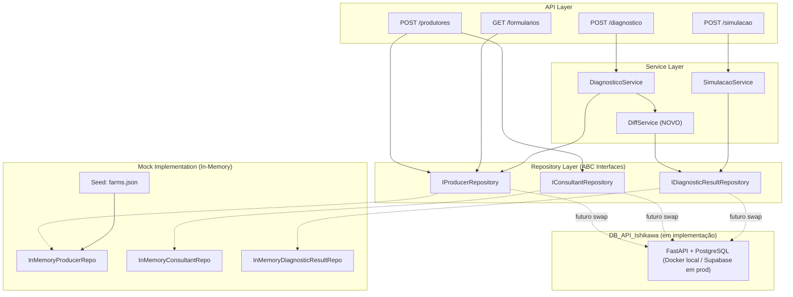
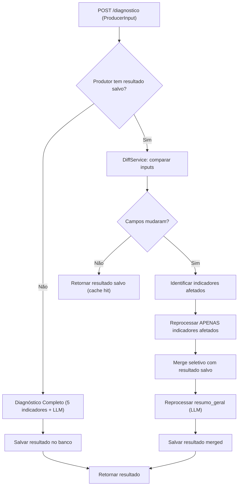
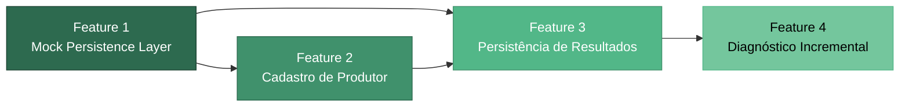

# 🗺️ Feature Roadmap: Persistência, Cadastro e Diagnóstico Incremental

> **Projeto:** `API_Ishikawa_Educampo`
> **Branch base:** `develop`
> **Data:** 2026-08-11 · **Revisado:** 2026-10-06 (sincronizado com o código)
> **Status:** Camada de persistência mock implementada (ver código) · Persistência real especificada em [feature_spec_db_api_ishikawa.md](./feature_spec_db_api_ishikawa.md)

> [!NOTE]
> **Estado atual (2026-10-07):** `IProducerRepository` e `IDiagnosticResultRepository` usam **Redis** (com fallback in-memory na inicialização); `IConsultantRepository` usa in-memory. O Redis é dívida técnica — ADR `2026-08-13-redis-as-transient-storage-pending-real-db`. A persistência real é o `DB_API_Ishikawa` (FastAPI + SQLAlchemy + PostgreSQL): **F1 (consultores/auth) e F2 (produtores) implementadas, F3 (resultados) em planejamento, F4 (seed/hardening/deploy) pendente**. Em produção o Postgres é o **Supabase (apenas Postgres gerenciado)**; em dev/CI é Docker. O DB_API é dono das credenciais (bcrypt + `POST /v1/auth/verify`); a API Ishikawa emite o JWT. Detalhes em `[[sdd-db-api-ishikawa]]` e [feature_spec_db_api_ishikawa.md](./feature_spec_db_api_ishikawa.md) (§13). As interfaces abaixo refletem o código real de `app/contracts/repositories.py`.

---

## 📋 Resumo Executivo

Transformação da API de um modelo stateless (dados em JSON/CSV) para um modelo com persistência mock (in-memory com interfaces ABC), cadastro de produtores via consultor, e diagnóstico incremental por campos alterados.

### Problemas Atuais
1. **Sem persistência de alterações** — Alterações feitas pelo produtor nos dados da fazenda não são registradas
2. **Diagnóstico completo a cada requisição** — Reprocessa todos os 5 indicadores + LLM mesmo que apenas 1 campo tenha mudado → alta latência + custo elevado com LLM
3. **`farms.json` como "banco"** — Sem suporte a concorrência, sem versionamento, frágil

### Decisões de Design Consolidadas (/grill-me)

| # | Decisão | Escolha |
|---|---------|---------|
| 1 | Padrão do mock | Interface ABC + InMemoryRepository (swap via Factory) |
| 2 | Segurança de senhas | Hash com `bcrypt`/`passlib` mesmo no mock |
| 3 | Mapeamento campo→indicador | Dict estático `CAMPO_INDICADOR_MAP` |
| 4 | Merge de resultados | Merge seletivo no callback (sobrescreve só indicadores afetados) |
| 5 | Relação Produtor↔Fazenda | 1:1, email como chave lógica + UUID interno |
| 6 | Decomposição em features | 4 features sequenciais com dependências claras |
| 7 | Auto-cadastro no worker | Removido — cadastro exclusivo pela rota dedicada |
| 8 | Persistência de resultados | Estrutura híbrida por produtor (`input_data` + `diagnostico` + `simulacao`) |
| 9 | Migração de rotas | Adaptar `/formularios` para ler do novo repositório; remover rotas legadas e `FarmsRepository` |
| 10 | Seed data | Popular o mock no startup com dados do `farms.json` existente |

---

## 🏗️ Arquitetura Alvo



---

## 📦 Feature 1 — Camada de Persistência Mock

> **Branch:** `feature/mock-persistence-layer`
> **Dependências:** Nenhuma
> **Estimativa:** Média complexidade

### Objetivo
Criar as interfaces abstratas (ABC) e implementações in-memory para Produtor, Consultor e Resultados de Diagnóstico, substituindo o `FarmsRepository` atual.

### Escopo

#### Interfaces (`app/contracts/repositories.py`) — como implementado

As interfaces trabalham com **entidades Pydantic** (`app/domain/entities.py`), não com `dict`.

```python
class IProducerRepository(ABC):
    def initialize(self) -> None: ...
    def is_initialized(self) -> bool: ...
    def get_all(self) -> List[ProducerEntity]: ...
    def find_by_id(self, producer_id: str) -> Optional[ProducerEntity]: ...
    def find_by_email(self, email: str) -> Optional[ProducerEntity]: ...
    def find_by_name(self, nome: str) -> Optional[ProducerEntity]: ...
    def create(self, producer: ProducerEntity) -> ProducerEntity: ...
    def update(self, producer: ProducerEntity) -> ProducerEntity: ...   # KeyError se não existir
    def delete(self, producer_id: str) -> bool: ...

class IConsultantRepository(ABC):
    def initialize(self) -> None: ...
    def is_initialized(self) -> bool: ...
    def get_all(self) -> List[ConsultantEntity]: ...
    def find_by_id(self, consultant_id: str) -> Optional[ConsultantEntity]: ...
    def find_by_email(self, email: str) -> Optional[ConsultantEntity]: ...
    def create(self, consultant: ConsultantEntity) -> ConsultantEntity: ...
    def update(self, consultant: ConsultantEntity) -> ConsultantEntity: ...

class IDiagnosticResultRepository(ABC):
    def initialize(self) -> None: ...
    def is_initialized(self) -> bool: ...
    def find_by_producer_id(self, producer_id: str) -> Optional[DiagnosticResultEntity]: ...
    def save(self, diagnostic_result: DiagnosticResultEntity) -> DiagnosticResultEntity: ...  # upsert
```

> [!NOTE]
> Divergências em relação ao plano original: `get_by_consultant` e `add_producer` não foram criados (vínculo feito por `ProducerEntity.consultant_id`); `save_diagnostic`/`save_simulation`/`get_saved_input` foram unificados em `save()`/`find_by_producer_id()` sobre `DiagnosticResultEntity` (`input_data`, `diagnostico`, `simulacao`).

#### Implementações In-Memory (`app/repositories/`)

| Arquivo | Responsabilidade |
|---------|-----------------|
| `in_memory_producer_repository.py` | Dict Python `{id: {...}}`, seed do `farms.json` no `__init__` |
| `in_memory_consultant_repository.py` | Dict Python `{id: {email, hashed_password, producers: []}}` |
| `in_memory_diagnostic_result_repository.py` | Dict Python `{producer_id: {input_data, diagnostico, simulacao, updated_at}}` |
| `redis_producer_repository.py` | ⚠️ Tech debt — storage compartilhado API↔worker (chaves `produtor:id:*`, `produtor:email:*`) |
| `redis_diagnostic_result_repository.py` | ⚠️ Tech debt — storage compartilhado de resultados |

#### Modelo de Dados — Produtor (In-Memory)
```python
{
    "id": "uuid-gerado",           # Chave primária
    "email": "produtor@email.com", # Chave lógica única
    "hashed_password": "$2b$...",  # Hash bcrypt
    "nome": "Fazenda X",
    "id_fazenda": "uuid-fazenda",
    "dados": {                     # ProducerInput completo
        "sistema_producao": "compost-barn",
        "regiao_sebrae": "triangulo",
        "total_vacas": 100,
        "percentual_lactacao": 85.0,
        "total_rebanho": 120,
        "area_atividade": 10.0,
        "numero_trabalhadores": 2,
        "producao_vaca": 35.0,
        "preco_recebido": 3.20,
        "preco_referencia": 2.50,
        "ccs": 150
    },
    "consultant_id": "uuid-consultor",
    "created_at": "2026-08-11T12:00:00",
    "updated_at": "2026-08-11T12:00:00"
}
```

#### Modelo de Dados — Consultor (In-Memory)
```python
{
    "id": "uuid-consultor",
    "email": "consultor@educampo.com",
    "hashed_password": "$2b$...",
    "producers_managed": ["uuid-produtor-1", "uuid-produtor-2"],
    "created_at": "2026-08-11T12:00:00"
}
```

#### Modelo de Dados — Resultado Diagnóstico (In-Memory)
```python
{
    "producer_id": "uuid-produtor",
    "input_data": { ... },  # ProducerInput que gerou esse diagnóstico
    "diagnostico": {
        "resumo_geral": { ... },
        "benchmarking": [ ... ],
        "indicadores": {
            "ccs": { ... },
            "preco_leite": { ... },
            "producao_area": { ... },
            "producao_funcionario": { ... },
            "producao_vaca": { ... }
        }
    },
    "simulacao": { ... },  # Último resultado de simulação
    "updated_at": "2026-08-11T12:00:00"
}
```

#### Remoções
- [x] Remover `farms_repository.py`
- [x] Remover rotas legadas `/test-data/*` de `formularios.py`
- [x] Remover referências ao `FarmsRepository` no `repository_factory.py`

#### Atualizações na Factory
- Registrar os 3 novos repositórios em `app/factories/repository_factory.py`
- Seed data: carregar `farms.json` e popular `InMemoryProducerRepository` no startup

#### Segurança
- Dependência: `passlib[bcrypt]` ou `bcrypt` (adicionar ao `requirements.txt`)
- Utility: criar `app/utils/security.py` com `hash_password()` e `verify_password()`

### DoD (Definition of Done)
- [ ] Interfaces ABC documentadas
- [ ] Implementações in-memory com testes unitários
- [ ] Seed data funcional a partir de `farms.json`
- [ ] Hash de senha com bcrypt funcional
- [ ] Factory atualizada com novos repositórios
- [ ] Código legado (`FarmsRepository`, rotas `/test-data/*`) removido
- [ ] Testes existentes adaptados para novo repositório

---

## 📦 Feature 2 — Rota de Cadastro de Produtor

> **Branch:** `feature/producer-registration`
> **Dependências:** Feature 1
> **Estimativa:** Baixa-média complexidade

### Objetivo
Criar o endpoint `POST /produtores` que permite ao consultor cadastrar um produtor com validação de email único, hash de senha, e associação automática consultor↔produtor.

### Escopo

#### Nova Rota (`app/api/endpoints/produtores.py`)

```python
# POST /produtores
# Input: ProducerRegistrationInput (ProducerInput + senha + email obrigatório)
# Output: { id, email, nome, message }
# Validações:
#   1. Email não pode ser duplicado (409 Conflict)
#   2. Senha hasheada com bcrypt antes de persistir
#   3. UUID gerado automaticamente
#   4. Consultor associado automaticamente (via header ou token futuro)
```

#### Novo Schema (`app/schemas/produtores.py`)
```python
class ProducerRegistrationInput(BaseModel):
    email: str = Field(..., description="Email único do produtor")
    senha: str = Field(..., min_length=6, description="Senha do produtor")
    nome_fazenda: str = Field(..., description="Nome da fazenda")
    # ... todos os campos de ProducerInput (herança ou composição)

class ProducerRegistrationResponse(BaseModel):
    id: str
    email: str
    nome_fazenda: str
    message: str
```

#### Atualização da Rota de Formulários
- `GET /formularios` → `fazendas_cadastradas` passa a ler do `IProducerRepository`
- `GET /formularios/farms/{nome}` → busca no `IProducerRepository`
- Remover `_load_farms_data()` e `_find_farm_by_name()` (delegados ao repositório)

#### Remoção do Auto-Cadastro no Worker
- Remover linhas 33-57 de `diagnostico_worker.py`

### DoD (Definition of Done)
- [ ] Endpoint `POST /produtores` funcional
- [ ] Validação de email único com resposta 409
- [ ] Senha hasheada com bcrypt
- [ ] Associação automática consultor↔produtor
- [ ] Rota `/formularios` atualizada para ler do novo repositório
- [ ] Auto-cadastro removido do worker
- [ ] Testes de integração para cadastro e duplicação de email

---

## 📦 Feature 3 — Persistência de Resultados

> **Branch:** `feature/diagnostic-result-persistence`
> **Dependências:** Feature 1, Feature 2
> **Estimativa:** Média complexidade

### Objetivo
Salvar os resultados de diagnóstico, benchmarking e simulação no banco mock, incluindo os dados de entrada (`ProducerInput`) que geraram o resultado — preparando a base para o diagnóstico incremental.

### Escopo

#### Atualização do Worker (`diagnostico_worker.py`)
No callback (`agrupar_diagnostico_callback`), após montar o `AnalysisResponse`:
1. Buscar o `producer_id` pelo email nos dados de entrada
2. Salvar via `IDiagnosticResultRepository.save(DiagnosticResultEntity(producer_id, input_data, diagnostico=result))`
3. O `input_data` é o `ProducerInput` serializado (dict)

#### Atualização da Rota de Simulação
Na rota `POST /simulacao`, após calcular o resultado:
1. Se o produtor tiver email, buscar `producer_id`
2. Buscar o resultado existente com `find_by_producer_id`, preencher `simulacao` e salvar via `save()`

#### Atualização do Endpoint de Status
Na rota `GET /diagnostico/status/{task_id}`, quando `status == completed`:
1. Incluir flag `is_cached: false` para indicar que é resultado novo

### DoD (Definition of Done)
- [ ] Resultados de diagnóstico salvos no mock após processamento
- [ ] Dados de entrada (`ProducerInput`) salvos junto ao resultado
- [ ] Resultados de simulação salvos no mock
- [ ] Testes unitários para persistência e recuperação

---

## 📦 Feature 4 — Diagnóstico Incremental

> **Branch:** `feature/incremental-diagnostic`
> **Dependências:** Feature 3
> **Estimativa:** Alta complexidade (feature principal)

### Objetivo
Ao receber uma nova requisição de diagnóstico, comparar os dados recebidos com os dados salvos no banco para identificar quais campos mudaram, determinar quais indicadores Ishikawa são afetados, e reprocessar apenas esses indicadores + sempre o `resumo_geral`.

### Escopo

#### Novo Módulo: `app/services/diff_service.py`

```python
class DiffService:
    """Compara dados de entrada e determina indicadores a reprocessar."""

    # Mapeamento estático: campo do ProducerInput → indicadores afetados
    CAMPO_INDICADOR_MAP = {
        "ccs":                   ["ccs", "preco_leite", "producao_vaca"],
        "producao_vaca":         ["producao_vaca", "producao_area", "producao_funcionario"],
        "total_vacas":           ["producao_vaca", "producao_area", "producao_funcionario"],
        "percentual_lactacao":   ["producao_vaca", "producao_area", "producao_funcionario"],
        "area_atividade":        ["producao_area"],
        "numero_trabalhadores":  ["producao_funcionario"],
        "preco_recebido":        ["preco_leite"],
        "preco_referencia":      ["preco_leite"],
        "sistema_producao":      ["ccs", "preco_leite", "producao_area", "producao_funcionario", "producao_vaca"],
        "regiao_sebrae":         ["ccs", "preco_leite", "producao_area", "producao_funcionario", "producao_vaca"],
        "total_rebanho":         [],  # Validação apenas, sem impacto direto em indicadores
    }

    def get_changed_fields(self, current: dict, saved: dict) -> List[str]:
        """Retorna lista de campos que diferem entre input atual e salvo."""
        ...

    def get_affected_indicators(self, changed_fields: List[str]) -> Set[str]:
        """Retorna o conjunto de indicadores que precisam ser reprocessados."""
        ...
```

> **Nota para revisão futura:** O `CAMPO_INDICADOR_MAP` acima opera no nível de indicador. Uma granularidade mais fina (nível de fatores de impacto ou práticas recomendadas dentro de cada indicador) pode ser explorada após validar o comportamento base. Registrar essa análise no Obsidian como ADR para o projeto `DB_API_Ishikawa`.

#### Atualização do Worker (`diagnostico_worker.py`)

```
Fluxo Atualizado:
1. Receber ProducerInput
2. Buscar producer_id pelo email
3. Se produtor existe no banco E tem resultado salvo:
   a. Chamar DiffService.get_changed_fields(input_atual, input_salvo)
   b. Se nenhum campo mudou → retornar resultado salvo (cache hit)
   c. Se campos mudaram:
      i.   DiffService.get_affected_indicators(campos_alterados)
      ii.  Reprocessar APENAS os indicadores afetados (engine + LLM)
      iii. Merge seletivo: sobrescrever indicadores afetados no resultado salvo
      iv.  SEMPRE reprocessar resumo_geral (depende de todos os indicadores)
      v.   SEMPRE recalcular benchmarking se campos afetarem indicadores
      vi.  Salvar resultado merged no banco
      vii. Retornar resultado completo
4. Se produtor NÃO tem resultado salvo:
   a. Diagnóstico completo (fluxo atual)
   b. Salvar resultado no banco
```



#### Impacto no Celery Chord
O chord atual dispara N sub-tasks LLM (uma por chunk de causas + resumo_geral). No modo incremental:
- Disparar sub-tasks apenas para indicadores afetados
- Sempre disparar a sub-task de `resumo_geral`
- O callback recebe `indicadores_anteriores` (do banco) e faz merge com os novos

### DoD (Definition of Done)
- [ ] `DiffService` implementado com `CAMPO_INDICADOR_MAP`
- [ ] Worker atualizado com lógica de diff + merge
- [ ] Cache hit funcional (sem mudanças = resultado salvo)
- [ ] Reprocessamento parcial (N indicadores < 5)
- [ ] `resumo_geral` sempre reprocessado
- [ ] Benchmarking recalculado quando necessário
- [ ] Testes unitários para DiffService
- [ ] Testes de integração para fluxo incremental
- [ ] Resultado merged salvo corretamente no banco

---

## 📐 Mapeamento de Dependências entre Features



---

## 📝 Notas para o Projeto `DB_API_Ishikawa` (Futuro)

> Especificação completa em [feature_spec_db_api_ishikawa.md](./feature_spec_db_api_ishikawa.md) · Repositório: https://github.com/MarcosVeniciu/DB_API_Ishikawa

1. **Interfaces ABC são o contrato** — O DB_API expõe endpoints 1:1 com os métodos acima (com ajustes de segurança e paginação descritos na spec)
2. **Schema de persistência** — PostgreSQL; modelo de dados na spec. Docker em dev/CI; **Supabase como Postgres gerenciado em staging/prod** (sem SDK/Auth do Supabase)
3. **Granularidade do diff** — Explorar mapeamento a nível de fatores de impacto (dentro de cada indicador) pode reduzir ainda mais o reprocessamento. Registrar como ADR
4. **Hash de senhas e credenciais** — Responsabilidade do DB_API (bcrypt); o hash nunca trafega de volta. Login via `POST /v1/auth/verify`; a API Ishikawa apenas emite o JWT e autoriza papéis (consultor cadastra produtor)
5. **Seed data** — `farms.json` vira script de import idempotente no DB_API

---

## 📊 Impacto Esperado

| Métrica | Antes | Depois |
|---------|-------|--------|
| Chamadas LLM por diagnóstico com 1 campo alterado | ~6 (5 indicadores + resumo) | ~2 (1 indicador + resumo) |
| Custo LLM estimado | ~$0.027/diagnóstico | ~$0.005-0.010/diagnóstico |
| Persistência de dados | Nenhuma (stateless) | Completa (input + resultado) |
| Cadastro de produtores | Auto-cadastro no worker | Rota dedicada com validação |

---

## 🗃️ Arquivos Impactados (Visão Geral)

| Arquivo | Feature | Ação |
|---------|---------|------|
| `app/contracts/repositories.py` | F1 | MODIFY — Adicionar 3 novas interfaces |
| `app/repositories/farms_repository.py` | F1 | DELETE |
| `app/repositories/in_memory_producer_repository.py` | F1 | NEW |
| `app/repositories/in_memory_consultant_repository.py` | F1 | NEW |
| `app/repositories/in_memory_diagnostic_result_repository.py` | F1 | NEW |
| `app/utils/security.py` | F1 | NEW |
| `app/factories/repository_factory.py` | F1 | MODIFY |
| `requirements.txt` | F1 | MODIFY |
| `app/api/endpoints/produtores.py` | F2 | NEW |
| `app/schemas/produtores.py` | F2 | NEW |
| `app/api/endpoints/formularios.py` | F2 | MODIFY — Remover legado, adaptar fonte |
| `app/workers/diagnostico_worker.py` | F2, F3, F4 | MODIFY — Remover auto-cadastro, adicionar persistência e diff |
| `app/api/endpoints/simulacao.py` | F3 | MODIFY — Persistir resultado |
| `app/services/diff_service.py` | F4 | NEW |
| `app/main.py` | F1 | MODIFY — Registrar nova rota `/produtores` |
