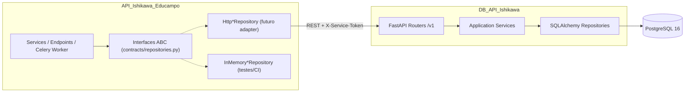
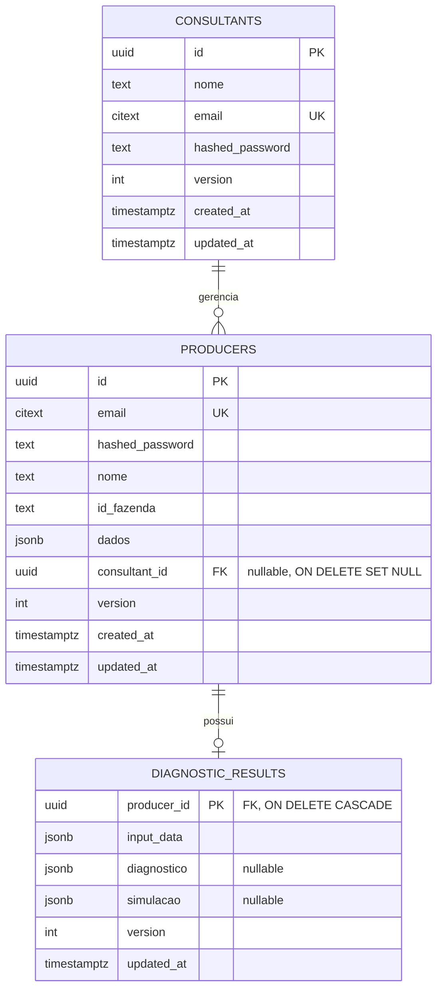
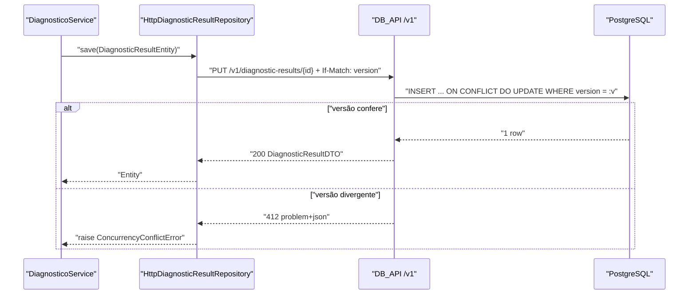

# 🗄️ Especificação: DB_API_Ishikawa (Serviço de Persistência)

> **Projeto:** [`DB_API_Ishikawa`](https://github.com/MarcosVeniciu/DB_API_Ishikawa) (repo pessoal; migração futura para `Educampo-UFV`)
> **Complementa:** [feature_roadmap_persistencia_incremental.md](./feature_roadmap_persistencia_incremental.md)
> **Data:** 2026-10-06
> **Obsidian SDD:** `[[sdd-db-api-ishikawa]]`
> **Status:** 📝 Especificação Validada
> **Escopo:** Apenas especificação. **Nada é implementado** e a `API_Ishikawa_Educampo` **não muda** agora.

---

## 1. Contexto e Objetivo

Hoje a persistência da `API_Ishikawa_Educampo` é simulada:

| Contrato (`app/contracts/repositories.py`) | Implementação ativa | Fallback |
|---|---|---|
| `IProducerRepository` | `RedisProducerRepository` | `InMemoryProducerRepository` |
| `IDiagnosticResultRepository` | `RedisDiagnosticResultRepository` | `InMemoryDiagnosticResultRepository` |
| `IConsultantRepository` | `InMemoryConsultantRepository` | — |

O Redis já está registrado como **dívida técnica** (ADR `2026-08-13-redis-as-transient-storage-pending-real-db`).

**Objetivo:** definir o `DB_API_Ishikawa` como um serviço separado que guarda os dados em PostgreSQL e oferece uma API REST interna. O contrato dessa API espelha **exatamente** as interfaces ABC atuais. Assim, a migração vira só uma troca de adapter na `RepositoryFactory`, sem mexer em services, rotas ou no worker.

### Critérios de Sucesso da Migração (futura)
1. **Zero alteração** em services, endpoints e workers da API Ishikawa: só um novo adapter `Http*Repository` e a troca na factory.
2. A mesma suíte de **testes de contrato** passa para `InMemory`, `Redis` e `Http` (Princípio de Substituição de Liskov).
3. O seed do `farms.json` pode ser importado de forma idempotente.
4. Latência p95 abaixo de 50 ms por operação de repositório na rede interna.

---

## 2. Decisões de Arquitetura

| # | Decisão | Escolha | Motivo |
|---|---|---|---|
| D1 | Banco | PostgreSQL 16 | Relacional, FKs, JSONB, constraints únicas |
| D2 | Stack do serviço | FastAPI + SQLAlchemy 2.0 + Alembic + Pydantic v2 | Mesma stack da API Ishikawa, curva zero |
| D3 | Protocolo | REST/JSON via HTTP interno | Já aprovado; simples de depurar |
| D4 | Contrato | Endpoints 1:1 com os métodos das interfaces ABC | Migração mecânica |
| D5 | Autenticação serviço↔serviço | Header `X-Service-Token` (segredo compartilhado), rede Docker interna | Simples; evolui para JWT/mTLS depois |
| D6 | Hash de senha | ✅ **Movido para o DB_API** (bcrypt). `hashed_password` **nunca** sai do DB_API; login via `POST /v1/auth/verify` | Hash fora da rede = menos superfície de ataque (ex.: vazamento de logs/respostas permite ataque offline) |
| D7 | `ProducerEntity.dados` | Coluna `JSONB` (sem normalizar agora) | Paridade 1:1 com a entidade; normalizar depois é uma migração Alembic |
| D8 | `ConsultantEntity.producers_managed` | **Derivado** via FK `producers.consultant_id` (não é guardado como array) | Uma fonte de verdade só; evita inconsistência |
| D9 | Diagnóstico | 1 linha por produtor (upsert), igual ao comportamento atual de `save()` | Paridade; histórico entra como evolução opcional (§9) |
| D10 | Concorrência | ✅ Lock otimista com coluna `version` + header `If-Match` no `PUT` (Entities ganham `version: int = 1`) | Evita *lost update* entre API e worker Celery |
| D11 | Erros | RFC 7807 (`application/problem+json`) | Mapeamento previsível para exceções no adapter |
| D12 | IDs | UUID gerado pelo **cliente** (a API Ishikawa já gera hoje) | Preserva os IDs do seed e os atuais |
| D13 | Listagens | ✅ Paginação obrigatória `?limit=50&offset=0` (máx. 200) + `X-Total-Count` | Evita carregar a tabela inteira na RAM (DB, rede e API) |
| D14 | Fallback | ✅ Proibido fora de `ENV=test`/`PERSISTENCE_BACKEND=memory`; fail-fast com retry na inicialização | Ver §8.1 |

---

## 3. Arquitetura Alvo



### 3.1 Estrutura de Pastas Proposta (`DB_API_Ishikawa`)

```text
DB_API_Ishikawa/
├── app/
│   ├── main.py                  # FastAPI + lifespan + healthchecks
│   ├── core/                    # settings (pydantic-settings), security (token), errors (RFC 7807)
│   ├── api/v1/                  # producers.py, consultants.py, diagnostic_results.py
│   ├── schemas/                 # DTOs Pydantic (espelho das Entities)
│   ├── services/                # regras de integridade (unicidade, version)
│   ├── db/
│   │   ├── models.py            # SQLAlchemy ORM
│   │   ├── session.py
│   │   └── repositories/        # acesso SQL
│   └── seed/import_farms.py     # import idempotente do farms.json
├── alembic/                     # migrações versionadas
├── tests/                       # unit + integração (testcontainers-postgres)
├── Dockerfile
└── docker-compose.yml
```

---

## 4. Modelo de Dados (PostgreSQL)



**Índices e constraints:**
- `producers.email` e `consultants.email`: `CITEXT UNIQUE`. Replica a normalização `strip().lower()` que o Redis faz hoje (o `strip` fica no DTO).
- `producers (lower(nome))`: índice para `find_by_name`, que hoje faz *full scan* no Redis.
- `producers (consultant_id)`: índice para montar `producers_managed`.

> [!IMPORTANT]
> `find_by_name` não tem constraint de unicidade, mas o contrato devolve `Optional[ProducerEntity]` (um só registro). O DB_API deve devolver o **mais antigo** (`ORDER BY created_at LIMIT 1`) para ser determinístico. Vale revisitar se essa busca ainda faz sentido no domínio.

---

## 5. Contrato da API REST (`/v1`)

Todas as rotas exigem `X-Service-Token`. Respostas usam JSON, com datas em ISO-8601 UTC.

### 5.1 Mapeamento Interface → Endpoint

| Interface.método | HTTP | Sucesso | Erros |
|---|---|---|---|
| `IProducerRepository.get_all()` | `GET /v1/producers?limit&offset` | 200 `[Producer]` + `X-Total-Count` | 422 limit > 200 |
| `.find_by_id(id)` | `GET /v1/producers/{id}` | 200 | 404 → `None` |
| `.find_by_email(email)` | `GET /v1/producers?email=` | 200 `[Producer]` (0..1) | — |
| `.find_by_name(nome)` | `GET /v1/producers?nome=` | 200 `[Producer]` (0..1) | — |
| `.create(p)` | `POST /v1/producers` | 201 | 409 email duplicado |
| `.update(p)` | `PUT /v1/producers/{id}` | 200 | 404 → `KeyError`; 412 version |
| `.delete(id)` | `DELETE /v1/producers/{id}` | 204 → `True` | 404 → `False` |
| `IConsultantRepository.get_all()` | `GET /v1/consultants?limit&offset` | 200 + `X-Total-Count` | — |
| *(novo)* verificar login | `POST /v1/auth/verify` `{email, password, role}` | 200 `{id, role}` | 401 credenciais inválidas (mesma resposta p/ email inexistente) |
| `.find_by_id(id)` | `GET /v1/consultants/{id}` | 200 | 404 → `None` |
| `.find_by_email(email)` | `GET /v1/consultants?email=` | 200 (0..1) | — |
| `.create(c)` | `POST /v1/consultants` | 201 | 409 |
| `.update(c)` | `PUT /v1/consultants/{id}` | 200 | 404, 412 |
| `IDiagnosticResultRepository.find_by_producer_id(id)` | `GET /v1/diagnostic-results/{producer_id}` | 200 | 404 → `None` |
| `.save(r)` | `PUT /v1/diagnostic-results/{producer_id}` (upsert) | 200/201 | 404 produtor inexistente |
| `initialize()` / `is_initialized()` | `GET /health/ready` | 200 | 503 |

> [!NOTE]
> Os métodos `initialize()` e `is_initialized()` não viram operações remotas. No adapter HTTP, `initialize()` faz um *ping* em `/health/ready`, e o seed passa a ser responsabilidade do DB_API (§7).

### 5.2 DTOs (Pydantic, espelho de `app/domain/entities.py`)

```python
class ProducerCreateDTO(BaseModel):       # entrada de POST
    id: UUID
    email: EmailStr
    password: SecretStr = Field(min_length=6)   # texto puro, só na entrada; DB_API faz bcrypt
    nome: str = Field(min_length=1)
    id_fazenda: Optional[str] = None
    dados: Dict[str, Any] = Field(default_factory=dict)
    consultant_id: Optional[UUID] = None

class ProducerDTO(BaseModel):             # saída — SEM hashed_password
    id: UUID
    email: EmailStr
    nome: str
    id_fazenda: Optional[str] = None
    dados: Dict[str, Any] = Field(default_factory=dict)
    consultant_id: Optional[UUID] = None
    created_at: datetime
    updated_at: datetime
    version: int = 1

class ConsultantDTO(BaseModel):           # saída — SEM hashed_password
    id: UUID
    nome: str
    email: EmailStr
    producers_managed: List[UUID] = []    # read-only, derivado da FK
    created_at: datetime
    version: int = 1

class DiagnosticResultDTO(BaseModel):
    producer_id: UUID
    input_data: Dict[str, Any]
    diagnostico: Optional[Dict[str, Any]] = None
    simulacao: Optional[Dict[str, Any]] = None
    updated_at: datetime
    version: int = 1

class Page(BaseModel, Generic[T]):
    items: List[T]
    total: int
    limit: int
    offset: int
```

> [!IMPORTANT]
> **Impacto de D6 na API Ishikawa (na migração):** `ProducerEntity`/`ConsultantEntity` deixam de ter `hashed_password` obrigatório; `auth.py` troca `verify_password()` local por `POST /v1/auth/verify`; `app/utils/security.py` perde o bcrypt. Tráfego de senha em texto puro exige rede interna + TLS em produção.
>
> **Impacto de D13:** `get_all()` nas interfaces ganha `limit: int = 50, offset: int = 0` (com default, não quebra chamadas atuais).

> [!WARNING]
> **Bug existente (confirmado no código):** `producers_managed` **nunca é preenchido**. O seed cria consultores com `producers_managed=[]` ([in_memory_consultant_repository.py:L41](file:///e:/Codigos/Educampo/API_Ishikawa_Educampo/app/repositories/in_memory_consultant_repository.py#L41)) e `POST /produtores` grava só `producer.consultant_id` ([produtores.py:L105](file:///e:/Codigos/Educampo/API_Ishikawa_Educampo/app/api/endpoints/produtores.py#L105)), sem atualizar o consultor. Resultado: `GET /auth/me` sempre devolve lista vazia ([auth.py:L147](file:///e:/Codigos/Educampo/API_Ishikawa_Educampo/app/api/endpoints/auth.py#L147)). D8 resolve isso estruturalmente: a lista é calculada por `SELECT id FROM producers WHERE consultant_id = :id`. No `PUT /v1/consultants` o campo é **ignorado**.

### 5.3 Erros (RFC 7807) → exceções no adapter

| HTTP | `type` | Tradução no `Http*Repository` |
|---|---|---|
| 404 | `not-found` | `None` / `False` / `KeyError` (conforme o método, §5.1) |
| 409 | `conflict-email` | `DuplicateEmailError` (novo, em `app/exceptions`) |
| 412 | `version-mismatch` | `ConcurrencyConflictError` (novo) |
| 401/403 | `unauthorized` | `PersistenceUnavailableError` + log crítico |
| 5xx / timeout | — | `PersistenceUnavailableError` |

---

## 6. Fluxos (Sequence)



---

## 7. Seed e Migração de Dados

- **Decisão já tomada:** os dados atuais em Redis/memória **não** serão migrados.
- `seed/import_farms.py` faz o mesmo mapeamento de `RedisProducerRepository._load_seed_if_empty()`: `id_fazenda → id`, email gerado como `{id}@educampo.mock` quando ausente, e `data_cadastro → created_at`.
- O import é idempotente: `INSERT ... ON CONFLICT (id) DO NOTHING`. Roda só com a flag `SEED_ON_STARTUP=true`, que fica `false` em produção.
- Os consultores mock vêm do seed atual de `InMemoryConsultantRepository`.

---

## 8. Plano de Migração na API Ishikawa (futuro, não executar agora)

| Fase | Ação | Risco |
|---|---|---|
| M0 | Criar uma **suíte de testes de contrato** parametrizada pelas implementações (InMemory, Redis) | Baixo |
| M1 | Subir o DB_API no `docker-compose` (serviços `db-api` e `postgres`) | Baixo |
| M2 | Criar `HttpProducerRepository`, `HttpConsultantRepository` e `HttpDiagnosticResultRepository` com `httpx.Client` **síncrono** (os contratos e o Celery são síncronos) | Médio |
| M3 | Criar a flag `PERSISTENCE_BACKEND=memory\|redis\|http` na `RepositoryFactory` | Médio |
| M4 | Rodar a suíte de contrato contra o `Http*` com o DB_API real (testcontainers) | Baixo |
| M5 | Ligar `http` em dev → homologação → produção | Médio |
| M6 | Remover `Redis*Repository` e fechar a ADR de dívida técnica | Baixo |

### 8.1 Resiliência do Adapter HTTP
- Timeouts: `connect=1s`, `read=3s`.
- Retry com backoff exponencial (3 tentativas) **somente** em `GET` e `PUT` idempotentes, e só em erros 5xx ou de conexão. Nunca em `POST`.
- Pool de conexões reutilizado (um `httpx.Client` por singleton da factory).
- Propagar o header `X-Request-ID` para rastrear a chamada entre os dois serviços.

### 8.2 Fallback silencioso (D14)

> [!CAUTION]
> **Como funciona hoje** ([repository_factory.py:L74-L93](file:///e:/Codigos/Educampo/API_Ishikawa_Educampo/app/factories/repository_factory.py#L74-L93)): o fallback só acontece **na criação do singleton** (startup). Se o Redis não responder nesse instante, o processo passa a usar a **RAM local daquele container** até ser reiniciado — mesmo que o Redis volte segundos depois. Se o Redis cair **depois** do startup, não há fallback: as chamadas lançam `redis.ConnectionError` (HTTP 500).
>
> **Cenário real:** `docker compose up` sobe `api-ishikawa` antes do Redis aceitar conexões → a API usa memória; o `celery_worker` sobe depois e usa Redis. Um produtor criado via `POST /produtores` fica só na RAM da API; o worker não o encontra e o diagnóstico não é salvo para ele. No próximo restart, o cadastro some. O único sinal é um `print` no log.

**Requisito para a migração:**
- Fallback para memória apenas com `ENV=test` ou `PERSISTENCE_BACKEND=memory`.
- Nos demais ambientes: retry com backoff na inicialização (ex.: 5 tentativas, até ~30s) e, se falhar, **encerrar o processo** (fail-fast) para o orquestrador reiniciar.
- `docker-compose`: `depends_on: condition: service_healthy` para Redis/DB_API.
- `/health/ready` da API Ishikawa reporta o backend de persistência ativo.

---

## 9. Evoluções Previstas (fora do escopo inicial)
- Tabela `diagnostic_history` (append-only) para guardar o histórico de diagnósticos.
- Normalizar `dados` em colunas tipadas, alinhadas ao `ProducerInput`.
- Trocar `X-Service-Token` por JWT de serviço ou mTLS.
- Migrar o adapter para async quando os contratos ABC forem async.

---

## 10. Inconsistências na Documentação Existente

✅ Resolvido em 2026-10-06: a seção de interfaces do [roadmap](./feature_roadmap_persistencia_incremental.md) foi sincronizada com `app/contracts/repositories.py`.

---

## 11. Decisões Registradas

| Questão | Decisão |
|---|---|
| Hash de senha | ✅ DB_API faz o hash e expõe `POST /v1/auth/verify` (D6) |
| Coluna `version` | ✅ Aprovada (D10) |
| Paginação | ✅ Obrigatória desde o início (D13) |
| Repositório | ✅ https://github.com/MarcosVeniciu/DB_API_Ishikawa (mover para `Educampo-UFV` depois) |
| Fallback | ✅ Fail-fast fora de testes (D14) |

### Pendência independente da migração
- Bug de `producers_managed` vazio em `GET /auth/me` (§5.2) pode ser corrigido já na API atual, derivando a lista do repositório de produtores.

---

## 12. DoD da Especificação
- [x] Questões em aberto respondidas
- [x] Roadmap original corrigido
- [x] Decisões D1–D14 revisadas e aprovadas em conjunto
- [x] Contrato REST (§5) validado contra `app/contracts/repositories.py`
- [x] Nota SDD criada no Obsidian (`sdd-db-api-ishikawa`) com link para `[[sdd-mock-persistence-layer]]`
