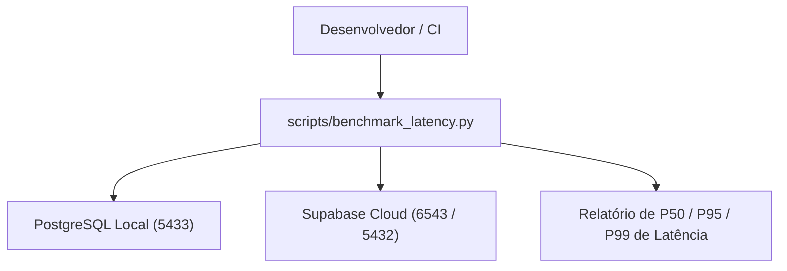

# Directory Documentation: `scripts`

## Overview
* **Purpose:** Scripts utilitários de operação, diagnóstico de performance e ferramentas auxiliares de infraestrutura da `DB_API_Ishikawa`.
* **Layer:** Operations / Tooling

## Architecture and Data Flow

## Component Mapping
* `benchmark_latency.py`: Utilitário para execução de baterias de testes de estresse de latência comparativa (local vs. nuvem Supabase), calculando percentis de latência (P50, P95 e P99).

## Design Decisions & Trade-offs
* **Decision:** Scripts operacionais mantidos fora do pacote executável `app/`.
* **Motivation:** Previne acoplamento desnecessário de ferramentas de benchmark à imagem de produção do servidor FastAPI.

## Testing Strategy
* **Test Types:** Integration
* **Critical Scenarios:** Teste automatizado de linha de base de latência (`tests/integration/test_baseline_latency.py`).

## Related Context
* Obsidian Vault: `[[2026-10-07-supabase-managed-postgres-and-credential-ownership]]`
