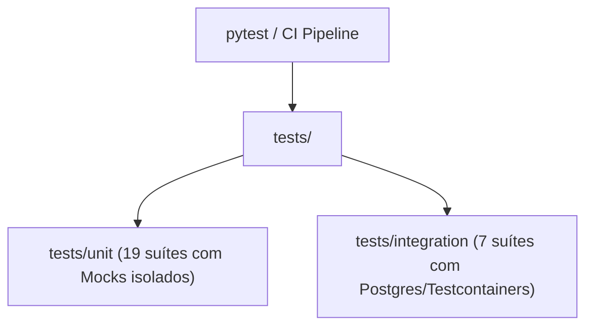

# Directory Documentation: `tests`

## Overview
* **Purpose:** Suíte de testes automatizados do microsserviço `DB_API_Ishikawa`. Organizada em duas camadas principais: testes unitários isolados e testes de integração de ponta a ponta com banco de dados relacional.
* **Layer:** Quality Assurance / Test Suite

## Architecture and Data Flow

## Component Mapping
* `unit/`: Suíte de testes unitários focada na validação de lógica de domínio, DTOs Pydantic, serviços com repositórios mockados e controladores HTTP.
* `integration/`: Suíte de testes de integração executados contra instâncias reais de PostgreSQL (usando Testcontainers e conexões Supabase).

## Design Decisions & Trade-offs
* **Decision:** Divisão estrita em diretórios `unit/` e `integration/` configurados no `pyproject.toml`.
* **Motivation:** Permite aos desenvolvedores rodarem testes unitários em poucos segundos durante o fluxo de TDD sem exigir Docker ou conectividade com a nuvem.

## Testing Strategy
* **Test Types:** Unit / Integration
* **Critical Scenarios:** Execução paralela e isolamento hermético entre testes.

## Related Context
* Obsidian Vault: `[[sdd-db-api-skeleton-consultants]]`, `[[bdd-db-api-skeleton-consultants]]`
