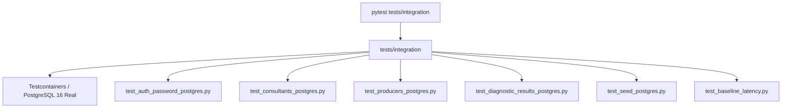

# Directory Documentation: `tests/integration`

## Overview
* **Purpose:** Suíte de testes de integração e persistência de ponta a ponta (E2E). Valida o comportamento do microsserviço contra instâncias reais de PostgreSQL (via Testcontainers ou Supabase), testando dialetos, constraints, tipos avançados (`CITEXT`, `JSONB`) e integridade referencial.
* **Layer:** Quality Assurance / Integration Testing

## Architecture and Data Flow

## Component Mapping
* `test_auth_password_postgres.py`: Validação de autenticação, hashing com `bcrypt` e persistência de senhas em PostgreSQL real.
* `test_baseline_latency.py`: Testes de carga e baseline de latência de leitura e escrita.
* `test_consultants_postgres.py`: Ciclo de vida de consultores com persistência real e verificação de constraints de unicidade (`CITEXT`).
* `test_diagnostic_results_postgres.py`: Teste de concorrência real simulando gravações paralelas com controle de versão otimista e lock atômico.
* `test_producers_postgres.py`: Persistência de produtores rurais, buscas case-insensitive por nome e vínculos com consultores.
* `test_seed_postgres.py`: Validação da importação idempotente a partir de `farms.json` em banco de dados real.

## Design Decisions & Trade-offs
* **Decision:** Execução contra PostgreSQL real com Testcontainers em vez de SQLite.
* **Motivation:** Previne incompatibilidades de dialeto, uma vez que SQLite não suporta nativamente extensões `CITEXT`, operadores `JSONB` avançados do Postgres e sintaxe `.returning()`.

## Testing Strategy
* **Test Types:** Integration
* **Critical Scenarios:** Conflitos reais de chave estrangeira, atomicidade de transações e comportamento de pools sob concorrência.

## Related Context
* Obsidian Vault: `[[2026-10-07-supabase-managed-postgres-and-credential-ownership]]`, `[[audit-persistencia-resultados]]`
