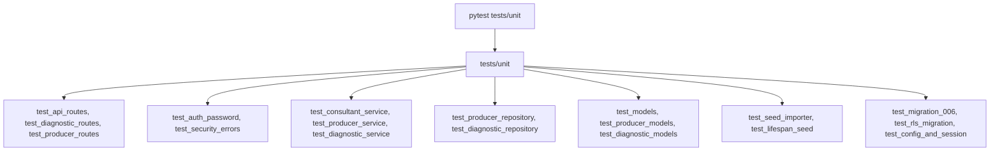

# Directory Documentation: `tests/unit`

## Overview
* **Purpose:** Suíte de testes unitários isolados da `DB_API_Ishikawa`. Abrange a validação atômica de regras de negócio, contratos de DTOs, mapeamento de erros RFC 7807, integridade de modelos ORM e comportamentos de serviços sem realizar chamadas de rede ou I/O pesado.
* **Layer:** Quality Assurance / Unit Testing

## Architecture and Data Flow

## Component Mapping
* `test_api_routes.py`: Verificação de endpoints de base e health checks.
* `test_auth_password.py`: Testes detalhados de validação de credenciais, troca de senhas e DTOs de autenticação.
* `test_config_and_session.py`: Testes unitários de carregamento de variáveis de ambiente e pooling.
* `test_consultant_service.py`: Regras de negócio de consultores (unicidade de e-mail, criação e listagem).
* `test_diagnostic_models.py`, `test_diagnostic_repository.py`, `test_diagnostic_routes.py`, `test_diagnostic_service.py`: Cobertura completa do ciclo de vida, persistência e lock otimista de diagnósticos agronômicos.
* `test_lifespan_seed.py`: Testes de inicialização condicional de seed no lifespan do FastAPI.
* `test_migration_006.py` e `test_rls_migration.py`: Verificações estruturais dos scripts de migração Alembic e políticas RLS.
* `test_models.py` e `test_producer_models.py`: Validação de mapeamentos relacionais e constraints.
* `test_producer_repository.py`, `test_producer_routes.py`, `test_producer_service.py`: Cobertura da camada de dados, regras de negócio e rotas de produtores rurais.
* `test_security_errors.py`: Testes de hashing com bcrypt, verificação de token de serviço e mapeamento RFC 7807.
* `test_seed_importer.py`: Validação de parsing de dados de fazendas e idempotência de importação.

## Design Decisions & Trade-offs
* **Decision:** Uso sistemático do padrão AAA (Arrange, Act, Assert) e mocks de fronteira via `unittest.mock`.
* **Motivation:** Elimina efeitos colaterais e garante que testes unitários possam ser executados de forma determinística em qualquer ambiente.

## Testing Strategy
* **Test Types:** Unit
* **Critical Scenarios:** Validação de Happy Path, Unhappy Path (HTTP 401, 404, 409, 412, 428) e limites de paginação.

## Related Context
* Obsidian Vault: `[[sdd-db-api-skeleton-consultants]]`, `[[bdd-db-api-skeleton-consultants]]`, `[[audit-persistencia-resultados]]`
